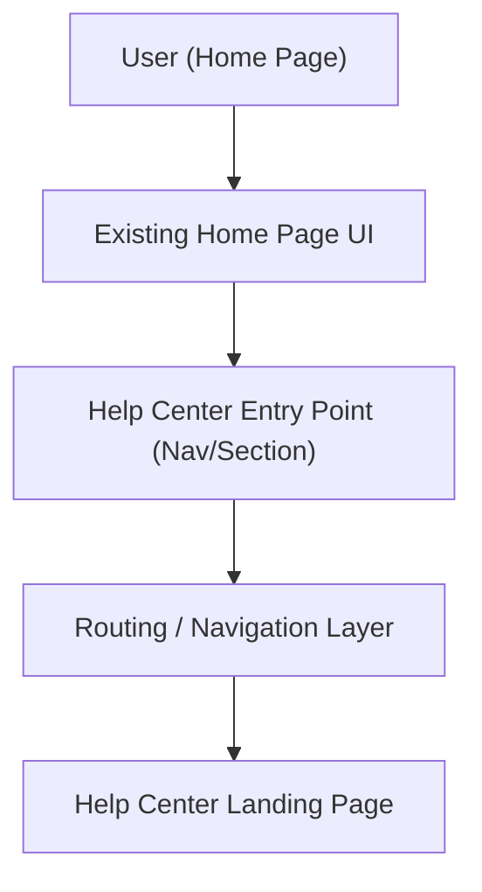

#### 1. High-Level Design
- Summary: Provide a clearly visible, accessible Help Center entry point on the Home Page that routes users to a dedicated Help Center landing page without disrupting existing layout or behavior, aligned with branding and WCAG 2.1 AA accessibility standards.
- Component Flow:

- Integration Points:
  - Existing website infrastructure and CMS for Home Page and routing
  - Branding guidelines and design system for the entry point UI
  - Accessibility framework and testing tools for WCAG 2.1 AA compliance
- Key Assumptions:
  - Navigation/routing to the Help Center landing page uses existing site navigation framework without custom routing logic.
  - Help Center landing page is already available or delivered by a separate epic and only needs to be linked from the Home Page.
- NFR Highlights: Help Center landing page must open within 2 seconds (4 seconds on mobile), entry point and navigation must comply with WCAG 2.1 AA, overall Help Center uptime 99.9%, all interactions over HTTPS.

#### 2. Validation Report
- Requirements Coverage: The proposed design covers the epic scope by adding a branded, accessible entry point on the Home Page, routing via existing navigation to the Help Center landing page, maintaining non-disruptive integration with current layout, and aligning with specified performance, accessibility, uptime, and security constraints.
