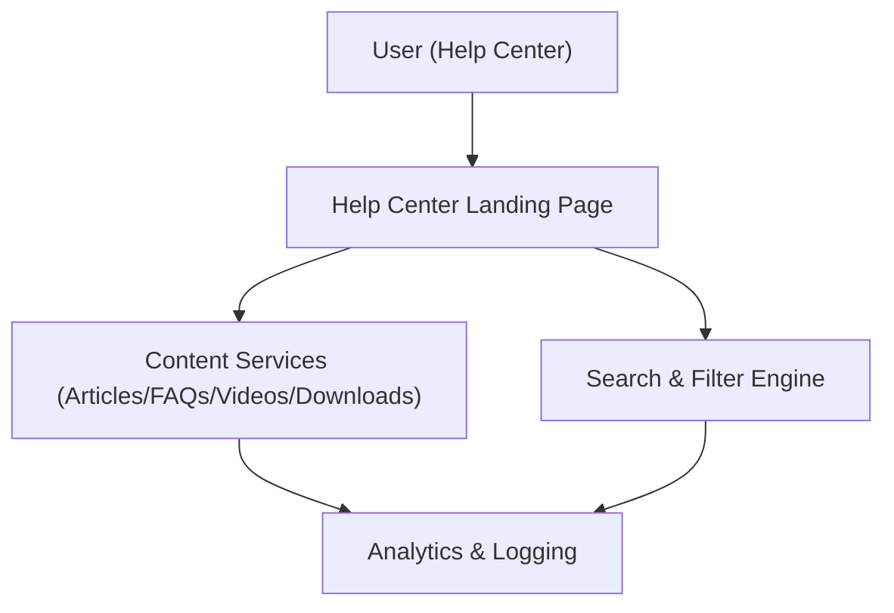

#### 1. High-Level Design
- Summary: Implement a dedicated Help Center landing page and full content experience with categorized articles, FAQs, videos, downloadable materials, search, filtering, error handling, responsive design, accessibility, and analytics for usage and content improvement.
- Component Flow:

- Integration Points:
  - Existing website infrastructure and CMS for hosting Help Center pages and content
  - Video hosting platform for tutorials
  - Analytics and logging systems for Help Center usage tracking
  - Editorial team workflows for content creation, maintenance, and updates
- Key Assumptions:
  - Content metadata (categories, types) is available via CMS and can be consumed by search and filtering without additional schema changes.
  - Analytics events (page views, searches, downloads, video plays) can be captured using the existing analytics platform with standard tagging.
- NFR Highlights: Landing page and content load within 2 seconds (4 seconds on mobile); video player loads/plays within 3 seconds; WCAG 2.1 AA accessibility for all content; downloads over HTTPS; up to 100,000 concurrent users; 99.9% uptime with robust error handling and automated fallback.

#### 2. Validation Report
- Requirements Coverage: The design addresses dedicated landing page, categorized content, text articles, embedded videos, downloadable materials, keyword search with filtering, responsive design, error handling, branding alignment, accessibility requirements, and analytics integration, while respecting performance, scale, uptime, and security NFRs defined in the epic.
