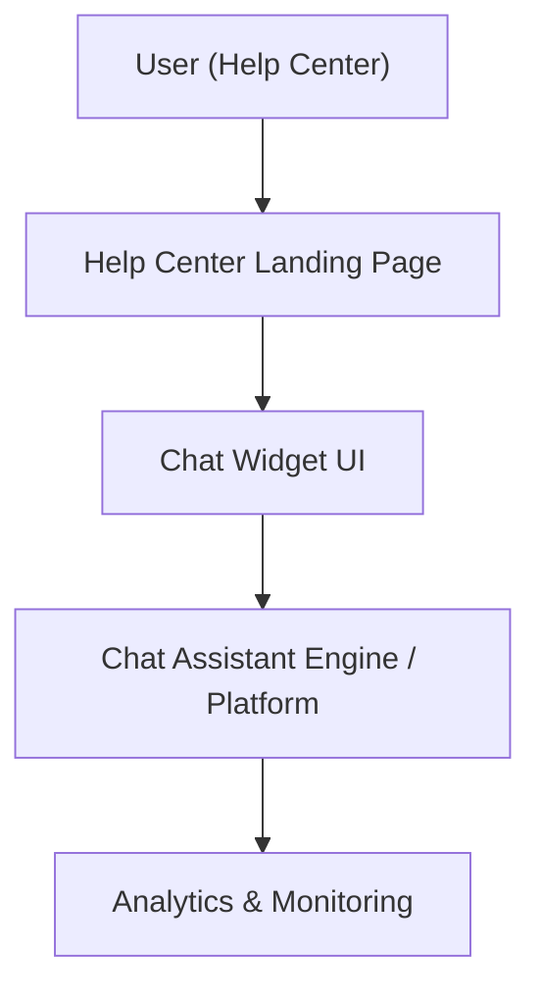

#### 1. High-Level Design
- Summary: Deliver an automated interactive chat assistant within the Help Center that provides real-time support, surfaces relevant help links, supports high concurrency, and feeds analytics/insights for support staff to monitor interactions and improve content, with strong security and accessibility.
- Component Flow:

- Integration Points:
  - Chat assistant technology platform for automated conversations and knowledge base
  - Existing website infrastructure for embedding the chat interface on the Help Center landing page
  - Analytics systems for tracking chat sessions, performance, and content improvement signals
  - Editorial/support teams for maintaining the chat knowledge base and monitoring insights
- Key Assumptions:
  - The chat platform exposes APIs or SDK suitable for secure embedding within the Help Center with HTTPS enforced.
  - Monitoring and analytics for chat sessions can be integrated into existing analytics/monitoring tools without separate infrastructure.
- NFR Highlights: Support up to 10,000 simultaneous chat sessions; all chat interactions over HTTPS; no exposure of sensitive user data; WCAG 2.1 AA-compliant chat UI; Help Center (including chat) maintains 99.9% uptime.

#### 2. Validation Report
- Requirements Coverage: The design covers an accessible chat entry point from the Help Center landing page, real-time automated responses, surfacing links to relevant help content, analytics and monitoring of chat sessions for support staff, responsive chat UI across devices, branding and accessibility requirements, and the specified concurrency, security, and reliability NFRs.
