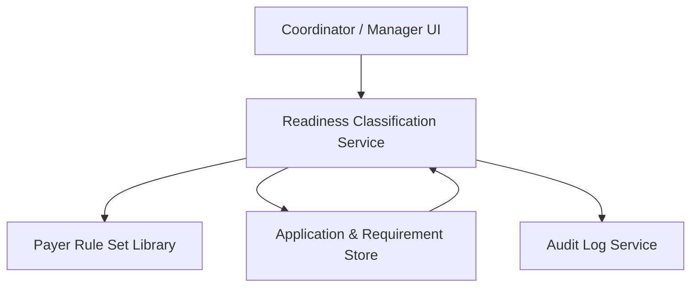

#### 1. High-Level Design
- Summary: Core deterministic readiness classification engine and payer-specific rule management for provider enrollment applications, producing explainable statuses at application, payer, and requirement levels with strict document validity, audit logging, and admin-managed rule sets.
- Component Flow:

- Integration Points: Identity provider (SAML SSO / MFA fallback) for RBAC; cloud object storage (e.g., S3/Blob) for encrypted documents and access logging; email service (SES/SendGrid) for notifications; OCR service (Textract/Document AI) for optional expiration date extraction; collaboration with credentialing SMEs and legal/compliance for rule definitions and BAAs.
- Key Assumptions:
  - Application and requirement data, including document metadata, are stored in a transactional relational or equivalent data store supporting versioned rule evaluation.
  - Payer rule set changes are managed solely via the admin UI with governance by credentialing SMEs, not via external automated ingestion.
- NFR Highlights: Must recalculate readiness within 5 seconds (up to 10 payers × 50 rules each), load application list within 3 seconds (≤500 active apps), encrypt data at rest with AES-256 and in transit with TLS 1.2+, support 200 concurrent users and 10,000 applications per org, maintain immutable audit logs, comply with HIPAA, WCAG 2.1 AA, and 99.5% uptime (daily backups, RPO 24h/RTO 4h).

#### 2. Validation Report
- Requirements Coverage: The design covers deterministic multi-level readiness classification against versioned payer rule sets, document validity and expiration handling, multi-payer evaluation, immutable audit logging, role-based access control, and rule set administration without code deployment, aligned with the PRD functional and non-functional requirements, while explicitly excluding out-of-scope integrations (payer portals, EHR, CAQH at launch, provider self-service).
