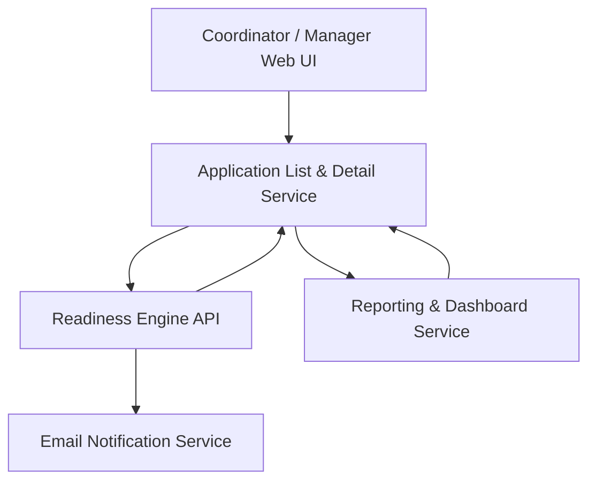

#### 1. High-Level Design
- Summary: Operational UI and workflow layer for coordinators and managers, providing application list and detail views, payer-level deficiency breakdowns, real-time status updates, alerts for expiring documents, dashboards, and reporting/export to manage the enrollment pipeline proactively.
- Component Flow:

- Integration Points: Email delivery service for expiration alerts and weekly digests; identity provider for authentication and RBAC; audit log infrastructure for trail reconstruction; cloud object storage for document links in views; optional connections to organizational time-tracking/KPI data for manager analytics (conceptual, not direct integration in v1).
- Key Assumptions:
  - The readiness engine from QE-5927 exposes APIs that support real-time status updates consumed by the coordinator/manager UI and dashboard components.
  - Reporting and export processes run server-side, reading from the same application and audit data stores while enforcing HIPAA constraints on what appears in exports and emails.
- NFR Highlights: Application list view ≤3 seconds for 500 active applications; dashboards ≤5 seconds; exports of up to 1,000 applications within 30 seconds; support 200 concurrent users; emails for threshold events within the same calendar day; HIPAA-compliant reporting and notifications; WCAG 2.1 AA UI and 99.5% reliability with transactional document upload handling.

#### 2. Validation Report
- Requirements Coverage: The design addresses coordinator list and detail workflows, per-payer breakdowns, worst-case overall application status, multi-payer handling, real-time status updates, automated expiration alerts, weekly digests, configurable thresholds, manager dashboards, CSV/PDF exports, and audit trail viewing with role-based visibility, consistent with the epic’s scope and PRD requirements and respecting out-of-scope items such as real-time payer feeds and external BI integrations.
