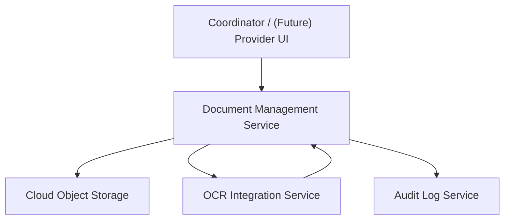

#### 1. High-Level Design
- Summary: Secure document ingestion, storage, and metadata management, including prevention of expired documents satisfying requirements, optional OCR-assisted expiration extraction with human confirmation, audit logging of document events, and foundational patterns for future provider self-service and CAQH integration.
- Component Flow:

- Integration Points: Cloud object storage for encrypted document storage and access logging; OCR service for expiration date extraction; email service for notifications related to expiring documents; identity provider/RBAC for document access control; future CAQH ProView API and provider portal; SMEs and legal/compliance for document rules and HIPAA BAAs.
- Key Assumptions:
  - Document metadata (type, expiration, uploader, timestamp) is persisted alongside requirement records and linked to readiness calculations in QE-5927/QE-5928.
  - OCR processing is asynchronous or near-real-time, returning extracted dates to the UI for user confirmation before persistence, with full logging of extracted vs. confirmed values.
- NFR Highlights: Document upload plus readiness recalculation visible within 5 seconds; storage up to 10 TB per organization with AES-256 at rest and TLS 1.2+ in transit; strict RBAC for PII/PHI access; HIPAA audit controls and transmission security; OCR workflows fully logged; 99.5% uptime with transactional uploads; support up to 500 payer rule sets affecting document requirements.

#### 2. Validation Report
- Requirements Coverage: The design fulfills secure document upload per requirement slot, metadata capture, expired document blocking with explicit messaging, OCR-assisted expiration extraction with user confirmation and override, audit logging for all document and metadata changes, encrypted object storage with access control, and supporting infrastructure for future provider portal and CAQH integration, while keeping deferred capabilities (provider self-service, CAQH, mobile, ML-based classification) clearly out of the initial implementation in line with the PRD and epic scope.
