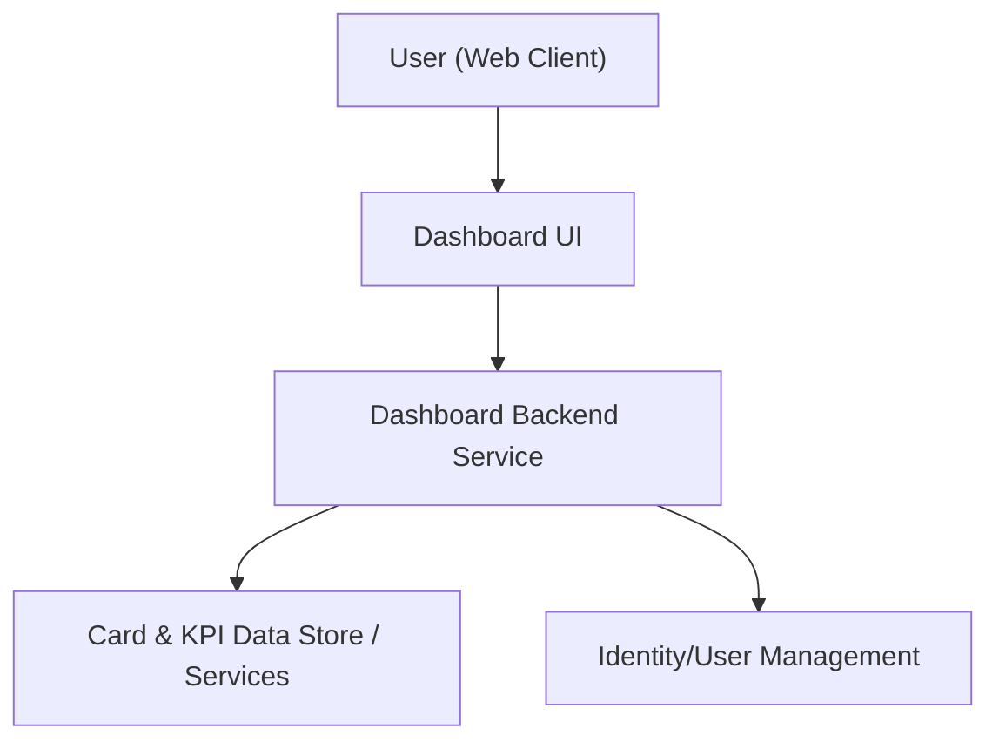

#### 1. High-Level Design
- Summary: Deliver a modern, responsive dashboard that consolidates all of a user’s credit cards into a single view with key KPIs: monthly spend, total credit limit, available credit, and outstanding amount, supporting users with one or multiple cards.

- Component Flow:

- Integration Points:
  - Internal data sources or mock services providing card metadata, balances, limits, and transaction aggregates.
  - Internal identity/user management to associate cards with a user profile.

- Key Assumptions:
  - Card and KPI data is exposed via internal APIs returning structured JSON for dashboard consumption.
  - User identity and card-to-user mappings are already established and available via the identity/user management system.

- NFR Highlights:
  - Dashboard must be responsive across desktop and mobile, load KPIs within acceptable UI response times, and remain readable and performant with multiple cards.

#### 2. Validation Report
- Requirements Coverage: The proposed design covers a responsive UI, consolidated multi-card view, and the four KPIs (monthly spend, total credit limit, available credit, outstanding amount), using internal data and identity services, and aligns with the stated NFRs and in-scope items while excluding out-of-scope real bank/payment integrations.

