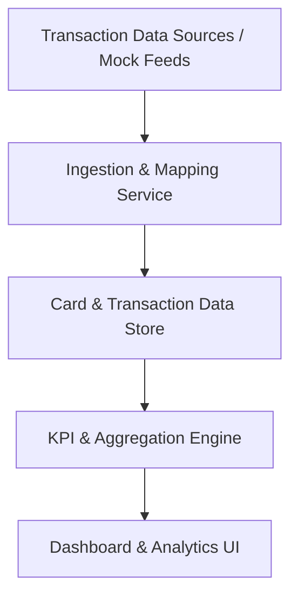

#### 1. High-Level Design
- Summary: Provide structured, analysis-ready representations of multiple credit cards and their transactions so the dashboard can compute KPIs, support trends, and visual analytics, without any payment or fund transfer functionality.

- Component Flow:

- Integration Points:
  - Internal transaction data sources or mock transaction feeds for card transactions.
  - Internal or external data storage services for persisting card and transaction records.

- Key Assumptions:
  - Transaction feeds provide sufficient identifiers (card ID, timestamps, amounts, category tags or mappable fields) to link transactions to specific cards.
  - Data store supports incremental updates and querying by user, card, and time period for KPI and trend computation.

- NFR Highlights:
  - System must handle typical consumer transaction volumes without noticeable degradation of dashboard responsiveness, maintain consistency between card-level metrics and underlying transactions, and follow basic data protection best practices for card/transaction metadata.

#### 2. Validation Report
- Requirements Coverage: The design supports modeling and displaying multiple cards and attributes, ingesting and mapping transactions to cards, preparing monthly spend figures, and enabling responsive layouts with multiple cards and transactions, while honoring performance, consistency, and data protection NFRs and excluding payment-related functionality.

