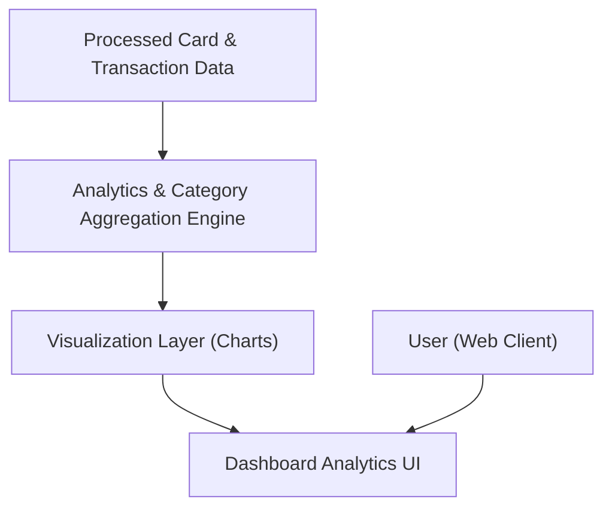

#### 1. High-Level Design
- Summary: Implement interactive visual analytics to show monthly spend trends, card-wise spend analysis, and category-wise breakdowns across predefined categories (Food & Dining, Fuel, Shopping, Travel, Entertainment, Utilities, Healthcare, Education, Miscellaneous), focusing on insight generation rather than transactions.

- Component Flow:

- Integration Points:
  - Processed transaction and card data from the card and transaction management layer (Epic QE-5943).
  - Visualization libraries or components (e.g., charting framework) used by the dashboard for rendering trends and category charts.

- Key Assumptions:
  - Category mappings (to Food & Dining, Fuel, etc.) are predefined and available within the analytics engine or data model.
  - Visualization library supports interactive filtering (by card, time range, category) with acceptable performance in standard browsers.

- NFR Highlights:
  - Visualizations must remain responsive and interactive for typical card/transaction volumes, render within acceptable UI response times when filters or time ranges change, and ensure category and trend calculations are accurate and consistent with underlying transaction data.

#### 2. Validation Report
- Requirements Coverage: The design enables monthly spend trends, card-wise spend, and category-wise analytics using predefined categories, leverages processed transaction data, and uses interactive visualizations that respect performance and accuracy NFRs, while staying within the insight-focused scope and excluding real bank and payment features.

