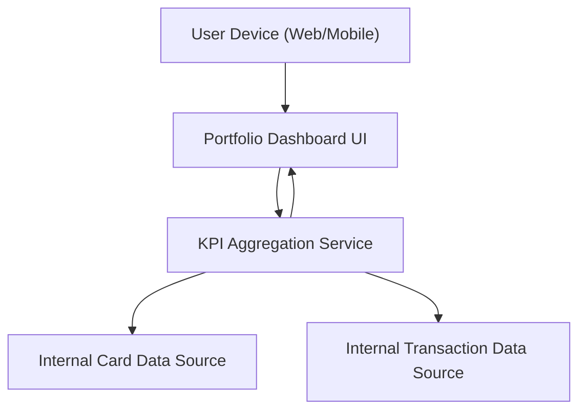

#### 1. High-Level Design
- Summary: Unified, responsive dashboard that consolidates all user credit cards into a single portfolio view, presenting key KPIs such as monthly spend, total credit limit, available credit, outstanding amounts, and a basic portfolio summary.

- Component Flow:

- Integration Points:
  - Internal card data source (mock/simulated) for card attributes and limits.
  - Internal transaction data source (mock/simulated) for monthly spend and outstanding amounts.
  - Optional internal analytics/data aggregation service for KPI calculations.

- Key Assumptions:
  - Card and transaction data are exposed via internal APIs or services returning structured JSON.
  - KPI calculations are performed on demand per user session, with simple aggregation logic over recent data.

- NFR Highlights:
  - Must support responsive layouts across desktop and mobile, render KPI calculations within typical UI latency, and present financial information clearly and non-misleadingly.

#### 2. Validation Report
- Requirements Coverage: The design covers a responsive, unified dashboard that aggregates multiple cards, computes and displays key KPIs (monthly spend, total limit, available credit, outstanding amounts), and provides a portfolio summary using internal card and transaction data sources with an aggregation service.
