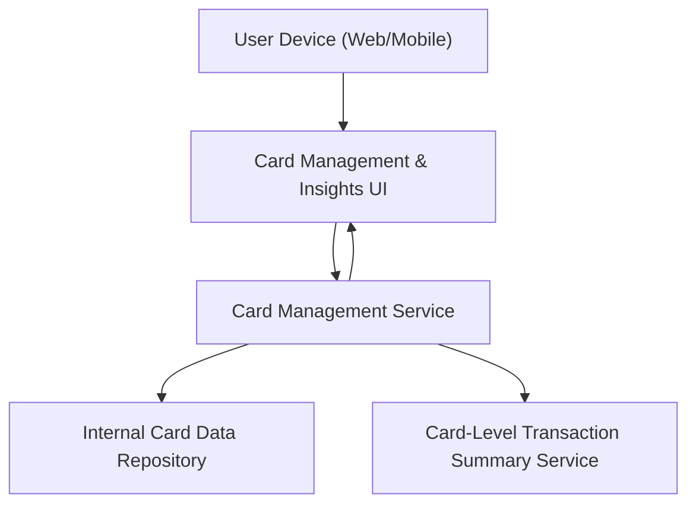

#### 1. High-Level Design
- Summary: Dashboard capabilities for managing multiple credit cards per user, providing card-level views and KPIs, and enabling users to switch between cards or view structured summaries and comparisons across cards.

- Component Flow:

- Integration Points:
  - Internal card data repository/mock card data service for card attributes, limits, and balances.
  - Transaction summary service per card for spend analysis and outstanding amounts.

- Key Assumptions:
  - Card list and card-level KPIs are retrieved via paginated APIs supporting multiple cards per user.
  - Card switching triggers lightweight API calls that return only the necessary card-level data for timely UI updates.

- NFR Highlights:
  - Must handle multiple cards per user without noticeable performance degradation and ensure card-level views update promptly when users switch cards.

#### 2. Validation Report
- Requirements Coverage: The design supports multiple cards per user, card-wise spend analysis, card-level KPIs (limit, available credit, outstanding), navigation between cards, and a card list/summary section, backed by internal card and transaction data services with a dedicated management service.
