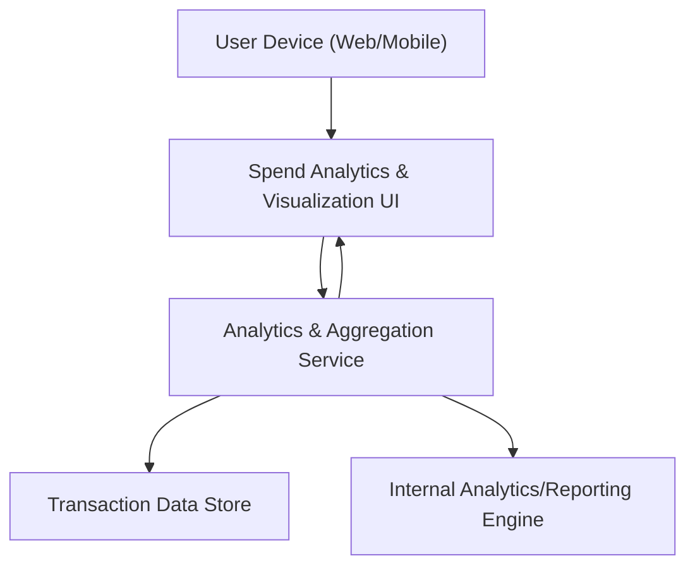

#### 1. High-Level Design
- Summary: Interactive analytics layer providing monthly spending trends, card-wise spend charts, and category-wise breakdowns across predefined spending categories to help users understand and optimize their expenses.

- Component Flow:

- Integration Points:
  - Transaction data store or mock transaction feeds for raw spend data.
  - Internal analytics/reporting engine for computing trends and category splits.

- Key Assumptions:
  - Transactions are tagged with standardized categories (Food & Dining, Fuel, Shopping, etc.) before analytics aggregation.
  - Analytics queries operate on pre-aggregated or indexed transaction data to keep visualizations responsive.

- NFR Highlights:
  - Visualizations must load with acceptable latency for typical transaction volumes, remain responsive across supported devices, and maintain user privacy in how spend data is presented.

#### 2. Validation Report
- Requirements Coverage: The design delivers monthly spend trends, card-wise and category-wise analytics, interactive charts over predefined categories, and basic transaction aggregation using a dedicated analytics service integrated with transaction data and an internal reporting engine, aligned with the stated NFRs.
