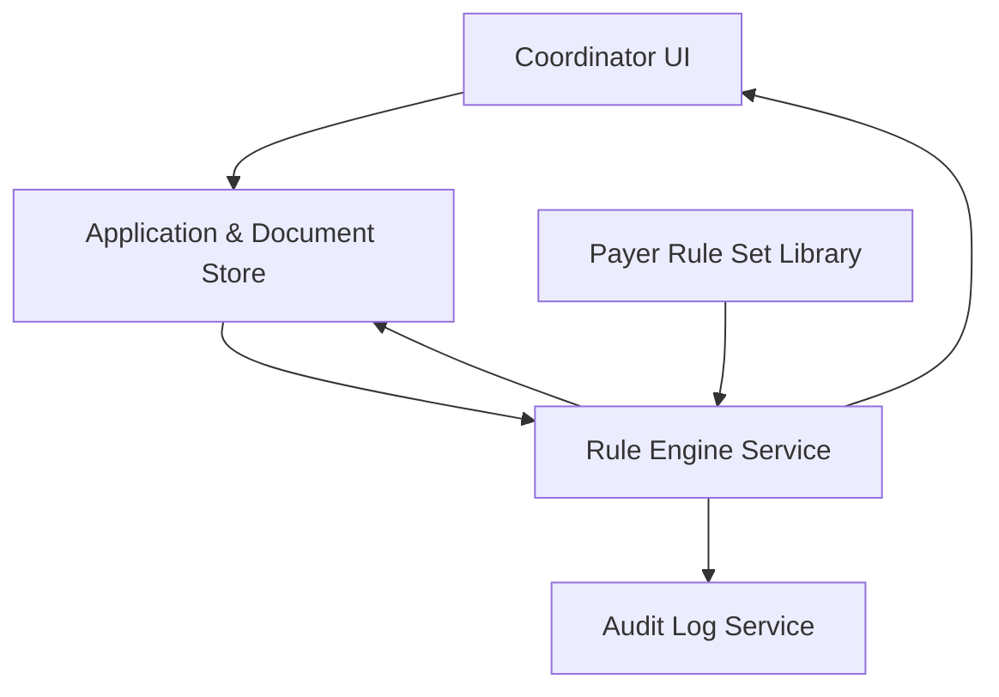

#### 1. High-Level Design
- Summary: Provides a deterministic rules engine that evaluates provider enrollment applications and documents against configurable payer-specific requirement sets, classifying readiness at application, payer, and individual requirement levels with full auditability.
- Component Flow:

- Integration Points: Identity provider for SAML/MFA authentication; cloud infrastructure for hosting rule engine and data stores; audit logging system; internal/SME-sourced payer requirement documentation for rule set maintenance.
- Key Assumptions: Application and document data are stored in a centralized, queryable store accessible to the rule engine; payer rule sets are maintained via an admin interface and are always in a valid state when applied.
- NFR Highlights: Deterministic, non-ML rule engine; recalculation and UI update within 5 seconds for up to 10 payers and 50 rules per payer; support for up to 10,000 applications and 500 payer rule sets; AES-256 at rest, TLS 1.2+ in transit; HIPAA-compliant with 99.5% uptime, daily backups, WCAG 2.1 AA.

#### 2. Validation Report
- Requirements Coverage: The design covers a configurable payer rule library, deterministic rule evaluation and classification across application/payer/requirement levels, real-time recalculation within specified performance thresholds, immutable audit trails, and security/compliance constraints as described in the epic and PRD.
