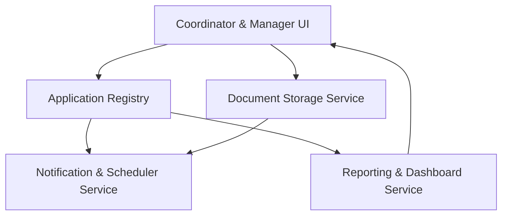

#### 1. High-Level Design
- Summary: Implements UI and workflow capabilities for managing provider enrollment applications and documents, including list/detail views, document upload and validation, expiration monitoring, alerts, dashboards, and reporting to support coordinators and managers.
- Component Flow:

- Integration Points: Cloud object storage (e.g., S3/Blob) for encrypted documents; email delivery service for alerts and weekly digests; internal job scheduler/background worker for expiration checks and digests; identity provider for SSO/auth; analytics/logging backend for exports and KPIs.
- Key Assumptions: Document metadata (including expiration) is stored alongside application records and is available to expiration jobs; reporting exports and dashboards are generated from the same application status data model used by the UI.
- NFR Highlights: List view ≤3s for 500 applications; exports ≤30s for 1,000 records; dashboards ≤5s; support for 200 concurrent users and up to 10 TB document storage; transactional uploads and full audit logging; keyboard-navigable UI with screen reader support.

#### 2. Validation Report
- Requirements Coverage: The design covers list/detail views, per-payer/per-requirement status display, document upload with metadata and validation, expiration warnings and Expiring Soon detection, automated notifications and weekly digests, dashboards, CSV/PDF exports, multi-payer consolidated views, and audit trail visualization as specified in the epic and PRD.
