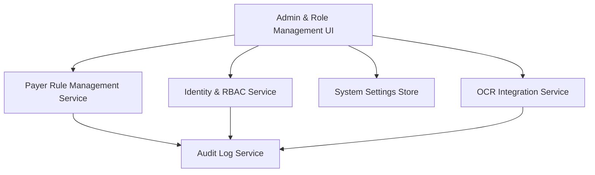

#### 1. High-Level Design
- Summary: Delivers administrative and security capabilities including RBAC, assignment-based access control, payer rule set management with versioning, configurable thresholds, OCR-assisted document metadata extraction, and comprehensive audit logging of admin and OCR activities.
- Component Flow:

- Integration Points: Identity provider for SAML SSO and role assertion/MFA; cloud object storage with access controls for protected documents; OCR service (e.g., Textract/Document AI); email service for admin notifications; legal/compliance processes for HIPAA BAAs; SME review for rule changes.
- Key Assumptions: Roles and assignments are enforced centrally and consumed by UI and APIs; OCR is optional and triggered only for supported document types, with human confirmation workflows implemented in the admin/coordinator UI.
- NFR Highlights: AES-256 at rest and TLS 1.2+ in transit; strict RBAC preventing cross-assignment access and logging denied attempts; immutable HIPAA-aligned audit logs; auditable OCR usage (extracted vs confirmed values); responsive admin UI in modern browsers; BAAs in place for all ePHI-handling vendors.

#### 2. Validation Report
- Requirements Coverage: The design covers coordinator/manager/admin roles with assignment-based access control, admin rule set versioning and thresholds, OCR-assisted expiration extraction with confirmation and overrides, audit logging for rule changes, OCR events, access attempts, system settings, and measurement/reporting of user adoption and activity, aligned with the epic and PRD.
