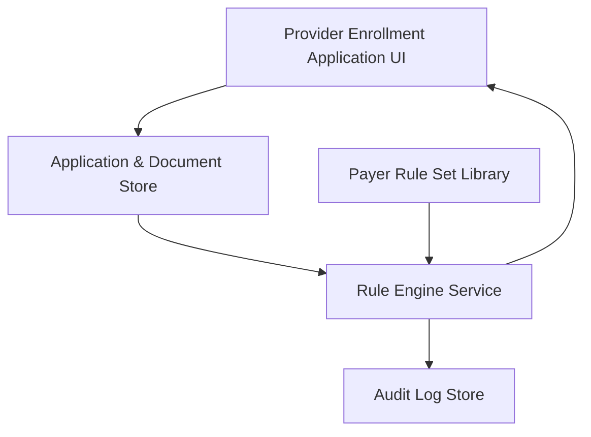

#### 1. High-Level Design
- Summary: Core deterministic engine that ingests provider enrollment application data and documents, applies payer-specific rule sets, and classifies readiness (Ready to Submit, Incomplete, Expiring Soon) at application, payer, and requirement levels with full auditability.
- Component Flow:

- Integration Points:
  - Identity provider supporting SAML 2.0 SSO or MFA.
  - Cloud object storage (e.g., AWS S3/Azure Blob) for secure document storage.
  - Email delivery service (e.g., AWS SES/SendGrid) for notifications.
  - Optional OCR service (e.g., AWS Textract/Google Document AI) for expiration extraction.
- Key Assumptions:
  - Application data and documents are stored in a centralized application/document store accessible by the rule engine.
  - Payer rule sets are maintained as structured, versioned configuration records (e.g., in a rules DB or config service).
- NFR Highlights: Must deterministically recalculate readiness within 5 seconds for up to 10 payers × 50 rules each, support 500 active applications in list view, 1,000-record exports within 30 seconds, immutable audit logging with 99.5% uptime, and HIPAA-compliant encryption and audit controls.

#### 2. Validation Report
- Requirements Coverage: The design includes ingestion of application and document data, a configurable payer rule engine, requirement-level classification, real-time recalculation on changes, document metadata handling and expiration logic, multi-payer evaluation, and an immutable audit trail, aligned with the epic’s described scope and NFRs.
