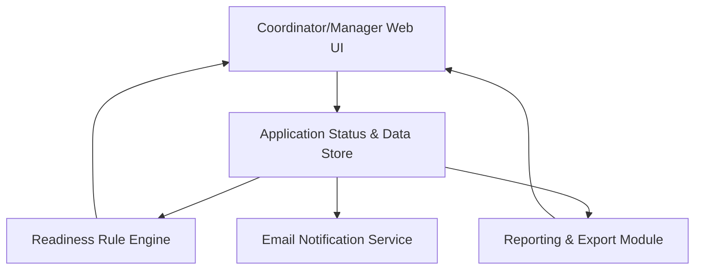

#### 1. High-Level Design
- Summary: User-facing workflows and views for coordinators and managers to manage provider enrollment applications, visualize per-payer readiness, prioritize work through queues and dashboards, generate reports/exports, and receive notifications on expiring documents and pipeline health.
- Component Flow:

- Integration Points:
  - Identity provider for SAML SSO or MFA-enabled login.
  - Email delivery service for alerts and weekly digests.
  - Audit logging framework for reporting/compliance views.
  - Underlying rule engine and application data model for status calculations.
  - Cloud object storage for linking documents in views.
- Key Assumptions:
  - Work queues, dashboards, and list/detail views are driven from a shared application status store that consumes outputs from the rule engine.
  - CSV/PDF exports are generated from the same reporting module used by dashboards, using pre-aggregated or query-based views of application data.
- NFR Highlights: Must support up to 500 active applications in list view (≤3s load), dashboards loading in ≤5s, exports of up to 1,000 records in ≤30s, up to 200 concurrent users, WCAG 2.1 AA accessibility, and 99.5% uptime with defined backup/recovery.

#### 2. Validation Report
- Requirements Coverage: The design provides list and detail views, per-payer readiness breakdowns, coordinator queues, manager dashboards, CSV/PDF exports, weekly digest and alert emails, multi-payer status support, and role-based views, consistent with the described operational workflow and visibility requirements and associated NFRs.
