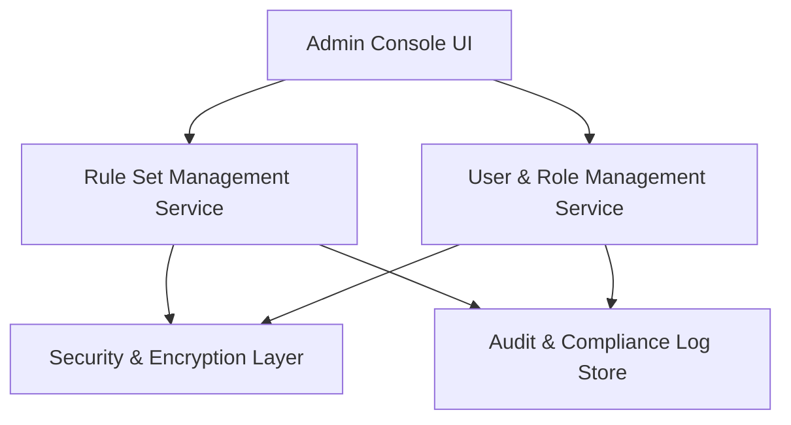

#### 1. High-Level Design
- Summary: Administrative and security foundation enabling non-technical admins to manage payer rule sets, system settings, users/roles, expiration thresholds, and audit trails while enforcing HIPAA-compliant controls, scalability, and reliability for the readiness-checking system.
- Component Flow:

- Integration Points:
  - Identity provider with SAML 2.0 SSO or MFA for admin authentication.
  - Cloud object storage with server-side encryption and access logging.
  - Email delivery service for admin notifications and alerts.
  - OCR service for optional expiration extraction when enabled.
  - Legal/compliance review and credentialing SMEs for rule library validation.
- Key Assumptions:
  - Rule set versioning, effective dates, and review metadata are managed through the Rule Set Management Service backed by a rules repository.
  - Audit logging spans admin actions, rule changes, access events, and document/status updates, centralized in an immutable audit store.
- NFR Highlights: Requires AES-256 encryption at rest, TLS 1.2+ in transit, support for 200 concurrent users, up to 10,000 applications, 500 rule sets, 10 TB of documents per org, 99.5% uptime with RPO 24h/RTO 4h, daily backups, full keyboard/screen reader support, and comprehensive action logging.

#### 2. Validation Report
- Requirements Coverage: The design supports rule set CRUD and versioning, expiration threshold configuration, user/role management, RBAC enforcement, immutable audit logging, rule review reminders, and security/compliance controls for encryption, scalability, backups, and HIPAA alignment, as specified in the epic’s scope and NFRs.
