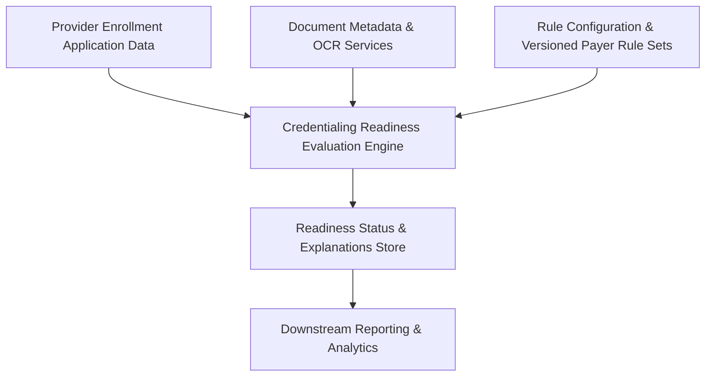

#### 1. High-Level Design
- Summary: Deterministic rule engine that evaluates provider enrollment applications and associated documents against payer-specific credentialing requirements, classifies readiness (Ready to Submit, Incomplete, Expiring Soon), and produces traceable, auditable explanations at application, payer, and requirement levels.

- Component Flow:

- Integration Points:
  - Structured data entry systems capturing provider enrollment data.
  - Document management/storage providing document metadata and expiration dates.
  - Optional OCR services with human confirmation for document metadata extraction.
  - Upstream credentialing data sources for licenses, certifications, malpractice policies.
  - Downstream reporting and analytics consuming readiness statuses and outcomes.

- Key Assumptions:
  - Application data and document metadata are provided in consistent, structured formats (e.g., via existing credentialing systems).
  - Rule configuration changes are governed by an internal change-management process with version control.

- NFR Highlights:
  - Deterministic, rule-traceable evaluations with support for multiple payer rule sets per application, near-real-time recalculation via batch/on-demand, and preserved historical rule behavior for audits.

#### 2. Validation Report
- Requirements Coverage: The design covers deterministic rule evaluation, payer-specific rule set configuration with versioning, multi-payer application assessment, readiness classifications (Ready to Submit, Incomplete, Expiring Soon), requirement-level statuses, configurable expiration thresholds, human-readable explanations, and support for both initial enrollment and re-credentialing scenarios as described in the epic.
