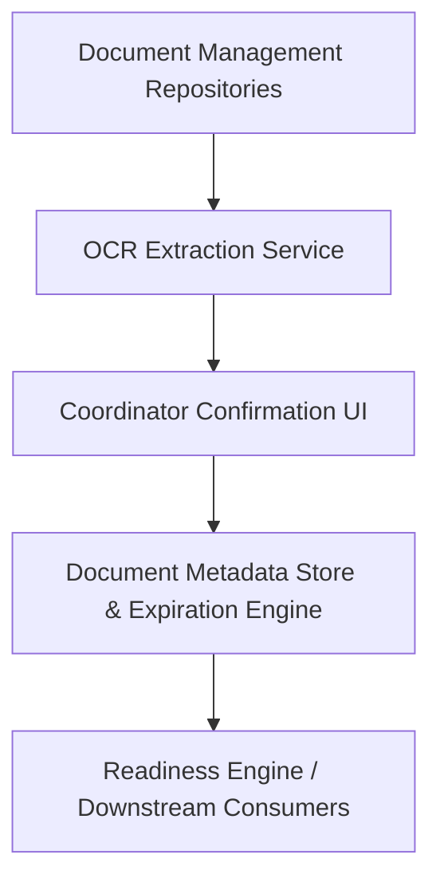

#### 1. High-Level Design
- Summary: Document metadata service that captures, stores, and monitors credentialing document attributes (including expiration dates), optionally uses OCR with human confirmation, identifies expired and expiring documents, and feeds status into enrollment and re-credentialing readiness evaluations.

- Component Flow:

- Integration Points:
  - Document management repositories providing source files.
  - OCR services to extract document metadata.
  - User interfaces for coordinators to confirm and correct OCR results.
  - Provider credentialing systems that maintain licenses, certifications, and malpractice data.
  - Downstream readiness engine consuming document metadata for status evaluation.

- Key Assumptions:
  - OCR outputs basic metadata fields (document type, issue date, expiration date) in a structured format that can be reviewed and corrected.
  - Expiration threshold configurations are centrally managed and versioned to support auditability and controlled changes.

- NFR Highlights:
  - Human-confirmed OCR parsing, reliable persistence of document metadata for audit, scalable expiration evaluation for typical organizational volumes, robust and change-controlled expiration thresholds, and role-based secure access to metadata.

#### 2. Validation Report
- Requirements Coverage: The design fulfills structured metadata capture, optional OCR-assisted extraction with human confirmation, expiration tracking for key credentialing documents, identification of expired and expiring documents within configurable thresholds, support for re-credentialing via proactive monitoring, and integration of document status into application and payer readiness evaluations as specified in the epic.
