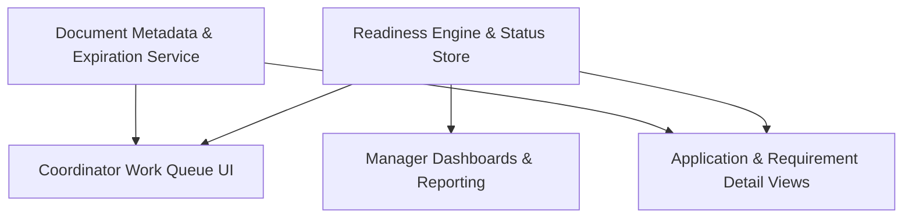

#### 1. High-Level Design
- Summary: User-facing coordinator and manager workflows that expose readiness engine and document tracking outputs via work queues, detailed application and payer views, requirement-level statuses, dashboards, and reporting to manage credentialing pipelines and reduce days-to-revenue.

- Component Flow:

- Integration Points:
  - Rule-based readiness engine providing application, payer, and requirement statuses.
  - Document metadata and expiration management services feeding document status data.
  - User identity and permission systems for coordinators and managers.
  - Email or communication tools for notifying providers of deficiencies.
  - Reporting and analytics tools for consuming pipeline status and KPI metrics.

- Key Assumptions:
  - The UI consumes readiness and document status via well-defined APIs that expose current and historical evaluations.
  - Role-based access control is already implemented in the identity/permission system and can be leveraged to restrict readiness views.

- NFR Highlights:
  - Responsive work queues and dashboards for 20–50 active applications per coordinator and organizational scales of 50+ annual new hires, current-enough status data for daily monitoring, auditability of UI/reporting aligned with rule sets and statuses at evaluation time, and secure access for authorized staff only.

#### 2. Validation Report
- Requirements Coverage: The design addresses coordinator work queues with readiness statuses, application and payer-level detail views of missing/expired/expiring requirements, requirement-level status views, status refresh aligned with batch recalculation, portfolio dashboards for managers, prioritization by start date/urgency, data exposure for weekly/monthly KPI reporting, and explanation views for communicating deficiencies, in line with the epic’s stated scope.
