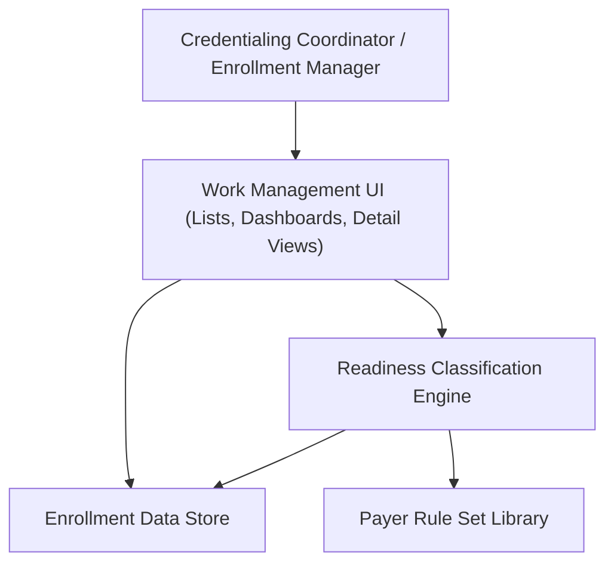

#### 1. High-Level Design
- Summary: Deliver work management UI (lists, dashboards, and detail views) for credentialing coordinators and enrollment managers to see application readiness, prioritize work by urgency/risk, and drill into per-payer deficiencies across high volumes of provider enrollment applications.

- Component Flow:

- Integration Points:
  - Automated readiness classification engine to supply per-payer and overall readiness statuses and risk/priority scores.
  - Payer-specific rule set library to ensure accurate status evaluation per payer.
  - Enrollment data store holding provider enrollment application records and payer associations.

- Key Assumptions:
  - Readiness statuses and priority/risk scores are precomputed by the readiness engine and exposed via APIs for the UI to consume.
  - Dashboard and list views query a read-optimized store (e.g., reporting schema or service) derived from the enrollment data store.

- NFR Highlights: Must provide responsive list and dashboard performance at scale for large volumes of applications and many payers per application, with status evaluation/display remaining performant as rule sets and volume grow.

#### 2. Validation Report
- Requirements Coverage: The design supports list and dashboard views over active applications with readiness buckets, overall status based on worst-case payer, per-payer deficiency drill-down, and prioritized queues driven by risk/priority scores, consistent with the epic’s stated scope and dependencies.

---
