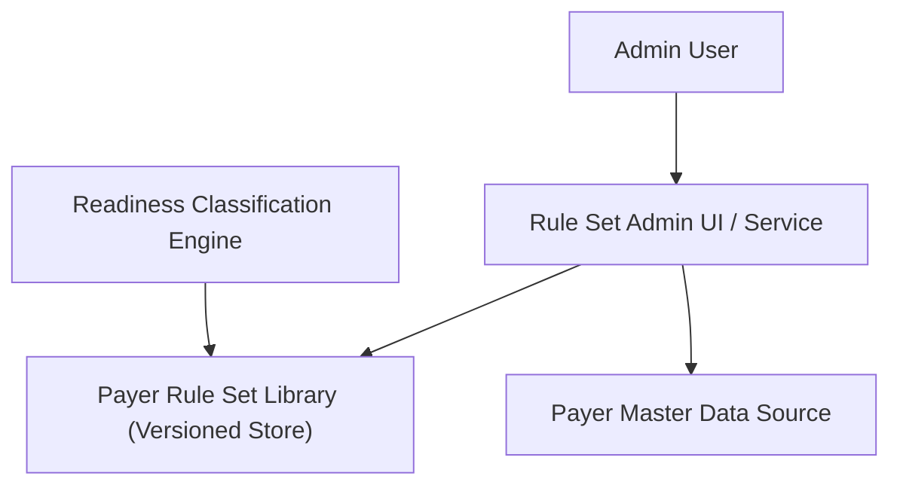

#### 1. High-Level Design
- Summary: Provide a configurable, versioned library of payer-specific rule sets (documents and data fields) with effective dating so applications are always evaluated against the correct rule version at submission time, including support for multiple payers per application and admin-driven configuration.

- Component Flow:

- Integration Points:
  - Administrative interfaces/services for configuring payer rule sets (documents, data fields, effective dates).
  - Readiness classification engine consuming the correct effective-dated rule versions for evaluations.
  - Master data source for payer identifiers and metadata.

- Key Assumptions:
  - All rule changes (create/update/retire) are written to an auditable store with user, timestamp, and change details for HIPAA-compliant auditing.
  - The readiness engine calls the rule set library with payer ID and submission timestamp to resolve the correct rule version.

- NFR Highlights: Must correctly handle historical effective dates, preserve evaluation performance for existing applications, and ensure rule configuration changes are auditable in a HIPAA-compliant environment.

#### 2. Validation Report
- Requirements Coverage: The design covers a centralized, configurable, versioned payer rule library with effective dating, historical evaluation logic, admin configurability, multi-payer support, and auditable changes, aligning with the epic’s scope and integration needs.

---
