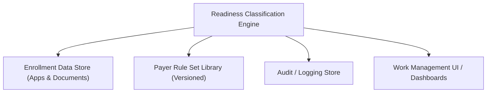

#### 1. High-Level Design
- Summary: Implement an automated readiness engine that evaluates provider enrollment applications against payer rule sets, assigns readiness buckets and requirement-level statuses, calculates priority, and produces detailed deficiency and outreach guidance, including expiration-aware logic.

- Component Flow:

- Integration Points:
  - Payer rule set library to provide requirement definitions and effective-dated rule versions.
  - Enrollment data store for application data, associated documents, and expiration details.
  - Work management UI/dashboards consuming statuses, deficiency details, and priority scores.
  - Audit/logging mechanisms to support HIPAA-aligned tracking of evaluations and access to ePHI.

- Key Assumptions:
  - Expiration thresholds (e.g., 90 days) are configurable parameters stored with rule sets or engine configuration and can be updated without code changes.
  - The engine operates in near real-time via event or change triggers from the enrollment data store (e.g., document added/updated) and exposes results via an API or messaging interface.

- NFR Highlights: Must evaluate applications accurately with correct effective-dated rules, support near real-time processing at scale, and comply with HIPAA Security and Privacy Rules for all ePHI processing.

#### 2. Validation Report
- Requirements Coverage: The design supports evaluation against all payer rule sets, assignment of readiness buckets, worst-case overall status logic, requirement-level statuses and expiration visibility, priority scoring, and threshold-based “Ready to Submit” gating, while aligning with performance and HIPAA constraints described in the epic.
