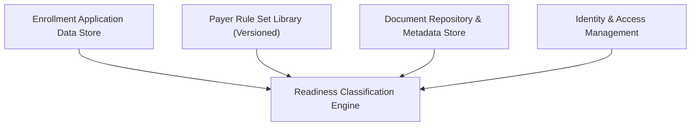

#### 1. High-Level Design

- Summary:  
  Implement a configurable readiness classification engine that evaluates provider enrollment applications against versioned, payer-specific rule sets, assigning statuses at application, payer, and requirement levels (Ready to Submit, Incomplete, Expiring Soon; Present & Valid, Missing, Expired, Expiring Soon), with correct rule versioning and multi-payer “worst-case” status handling.

- Component Flow:

- Integration Points:
  - Upstream provider enrollment application capture/data store providing documents and fields.
  - Payer rule set administration capability with versioned rule sets and effective dates.
  - Document repository and metadata store for document status and expiration dates.
  - Identity and access management enforcing HIPAA-compliant access.

- Key Assumptions:
  - Rule set version selection is based on application submission date stored with each application record.
  - Readiness results (per payer and overall) are persisted or cached for reuse by downstream list/detail views rather than recomputed on every request.

- NFR Highlights:
  - Must comply with HIPAA; must reliably apply historically correct rule versions and correctly isolate multi-payer evaluations to ensure auditability and avoid cross-contamination of payer-specific results.

#### 2. Validation Report

- Requirements Coverage:  
  The design addresses configurable rule sets with versioning, automated evaluation, payer- and requirement-level statuses, overall worst-case application status, historical rule application, and multi-payer handling, matching the epic’s described scope, NFRs, and dependencies.
