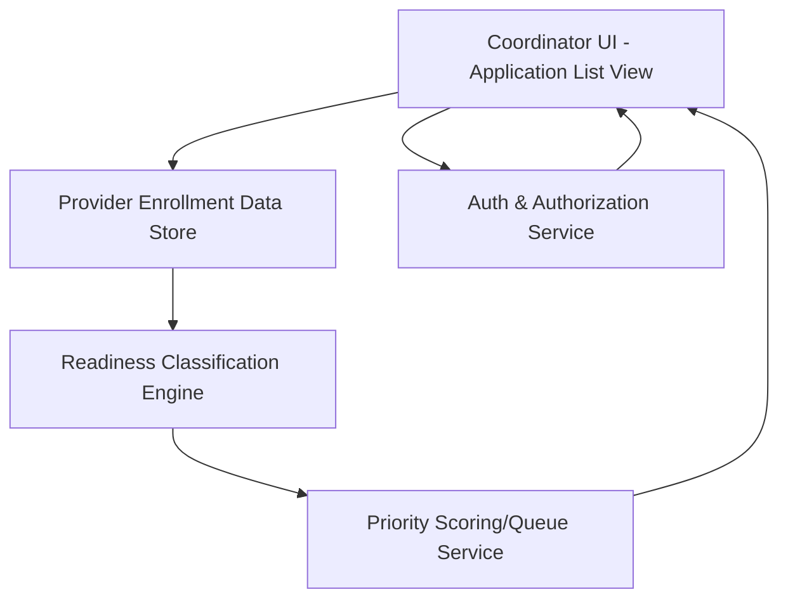

#### 1. High-Level Design

- Summary:  
  Deliver an application list view that surfaces all active provider enrollment applications with statuses (Ready to Submit, Incomplete, Expiring Soon), provides filtering/sorting and status summaries, and orders the list by urgency using readiness status and priority factors to function as a prioritized work queue.

- Component Flow:

- Integration Points:
  - Readiness classification engine for application- and payer-level statuses.
  - Provider enrollment data store for application records and metadata.
  - Priority/queue logic using readiness outputs and configured urgency rules.
  - User authentication and authorization services restricting list access.

- Key Assumptions:
  - Priority rules (e.g., time-to-expiry, payer weighting) are maintained via configuration and applied in a dedicated scoring component.
  - Multi-payer “worst-case” status computation is performed by the readiness engine or a closely coupled service before queue ordering.

- NFR Highlights:
  - Must comply with HIPAA; list queries and sort operations must perform efficiently at operational scale, and priority computation must be deterministic and auditable.

#### 2. Validation Report

- Requirements Coverage:  
  The design covers list-level readiness status, filtering and sorting, status counts, prioritized queue behavior, and multi-payer worst-case status derivation, consistent with the epic’s description, dependencies, and NFRs.
