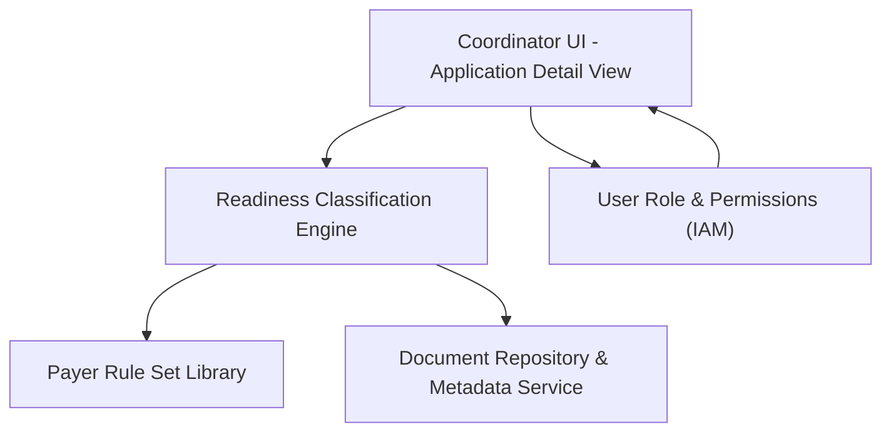

#### 1. High-Level Design

- Summary:  
  Provide an application detail view that, for each application–payer combination, shows per-requirement readiness status (Present & Valid, Missing, Expired, Expiring Soon) with exact expiration dates and generates outreach-ready deficiency recommendations, supporting independent drill-down by payer in multi-payer applications.

- Component Flow:

- Integration Points:
  - Readiness classification engine providing requirement-level statuses and expiration evaluations.
  - Payer rule set library defining required documents and data fields per payer.
  - Document storage and metadata services for document retrieval and expiration dates.
  - User role and permissions framework (IAM) to enforce access control.

- Key Assumptions:
  - Deficiency recommendations are generated synchronously at view time based on current readiness engine output and rule sets.
  - Recommendation text templates (e.g., phrasing for outreach) are centrally configured and reusable across payers.

- NFR Highlights:
  - Must comply with HIPAA Security and Privacy Rules; deficiency and recommendation data must be accurate, auditable, and support responsive UI performance for daily operational use.

#### 2. Validation Report

- Requirements Coverage:  
  The design supports per-payer, per-requirement statuses, exact expiration dates, outreach-ready recommendations, and independent multi-payer drill-down while leveraging the readiness engine, rule sets, document metadata, and IAM, aligning with epic scope and NFRs as described.
