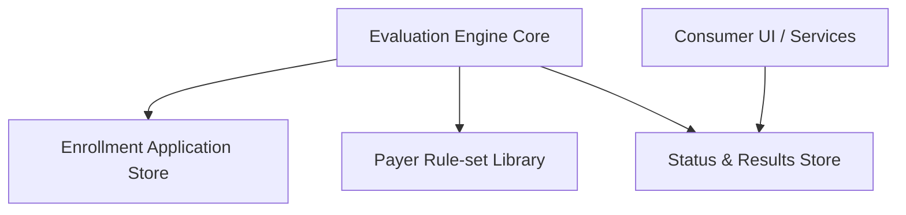

#### 1. High-Level Design
- Summary: Build a core evaluation engine that applies payer-specific rule sets to enrollment applications, assigning readiness statuses at application, payer, and requirement levels while honoring versioned rules and supporting both new enrollment and re-credentialing.

- Component Flow:

- Integration Points:
  - Provider enrollment application data store for documents and data fields.
  - Payer rule-set configuration and administration module.
  - Identity and access management for role-based access (e.g., Coordinator, Manager).
  - Downstream consumer UIs/services (e.g., queues, dashboards) that read statuses.

- Key Assumptions:
  - Application submission date is reliably available to select the correct rule-set version.
  - Evaluation results are persisted in a structured store that can be reused by multiple consumer services.

- NFR Highlights:
  - Must comply with HIPAA for storing/processing ePHI, apply correct rule-set versions based on submission date, and ensure deterministic, auditable readiness classifications.

#### 2. Validation Report
- Requirements Coverage: The design supports rule-set-based evaluation, versioning with effective dates, multi-payer evaluation, application/payer/requirement-level statuses, expiration thresholds (e.g., 90 days), and support for both new enrollment and re-credentialing, matching the epic’s scope and NFR expectations.
