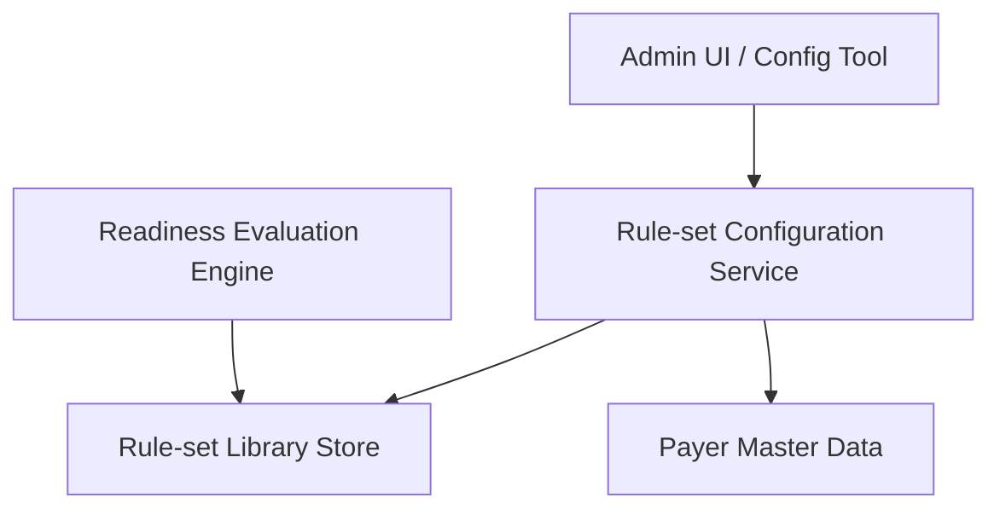

#### 1. High-Level Design
- Summary: Deliver an admin-configurable library of payer-specific requirement rule sets (with versioning and effective dates) that define the documents and data fields required per payer, including pre-built configurations for high-volume payers and multi-payer support.

- Component Flow:

- Integration Points:
  - Admin configuration interface or service for managing rule sets.
  - Payer master data/catalog to uniquely identify payers.
  - Readiness evaluation engine that consumes rule sets for evaluations.
  - Enrollment application platform schema for documents and data fields.

- Key Assumptions:
  - Rule-set library is stored in a versioned, audit-ready configuration store accessible by the evaluation engine.
  - Admin changes are deployed through an existing governance/release process for configuration changes.

- NFR Highlights:
  - Must comply with HIPAA for any ePHI-related fields, ensure versioned and traceable rule-set changes, and avoid disrupting historical evaluations.

#### 2. Validation Report
- Requirements Coverage: The design supports configurable payer rule sets, versioning with effective dates, historical rule application, pre-built payer configurations, admin updates, and multi-payer rules in alignment with the epic scope and dependencies.
