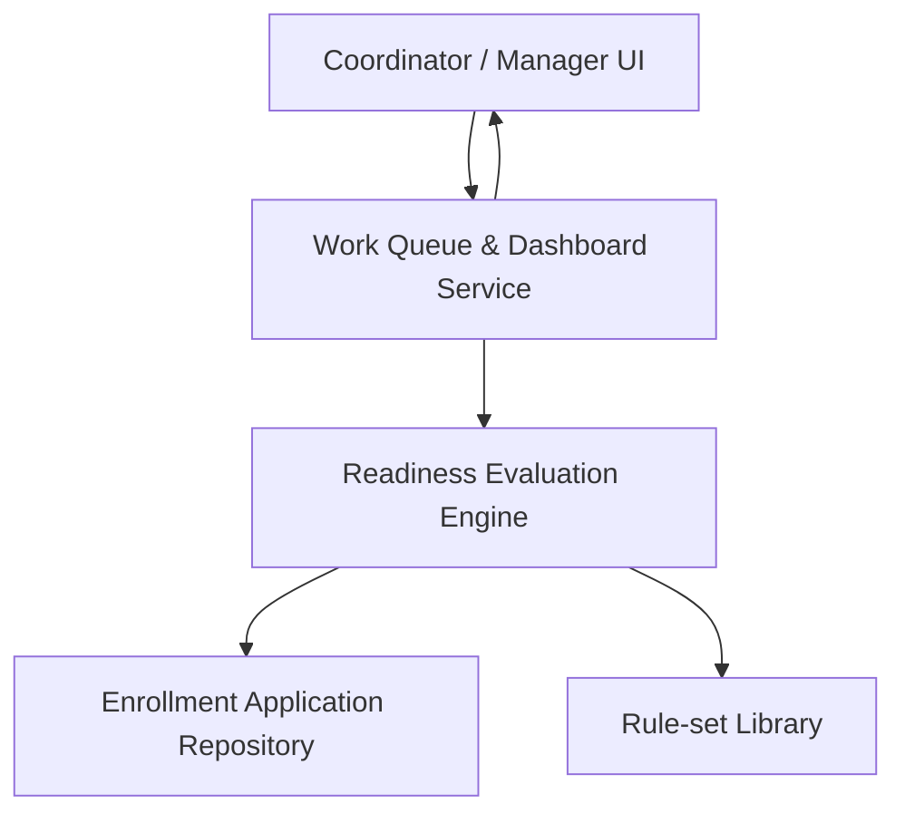

#### 1. High-Level Design
- Summary: Provide coordinated list, dashboard, and detailed deficiency views for Credentialing Coordinators and Enrollment Managers so they can prioritize, monitor, and remediate provider enrollment applications based on readiness statuses and requirement-level deficiencies.

- Component Flow:

- Integration Points:
  - Readiness evaluation engine providing application, payer, and requirement-level statuses.
  - Provider enrollment application repository for source data and documents.
  - Rule-set library to supply requirement names and descriptions.
  - User directory / role-based access to distinguish coordinators and managers.

- Key Assumptions:
  - UI consumes existing readiness data from the evaluation engine and does not re-implement evaluation logic.
  - Role and user information are provided by an existing enterprise identity/role management system.

- NFR Highlights:
  - Must comply with HIPAA Security and Privacy Rules for ePHI, provide clear and consistent status representations, and ensure deterministic/consistent priority scoring.

#### 2. Validation Report
- Requirements Coverage: The design supports list views, status-based filtering and sorting, prioritized queues, dashboards with drill-downs, and requirement-level deficiency views, leveraging the evaluation engine and repositories as described in the epic.
