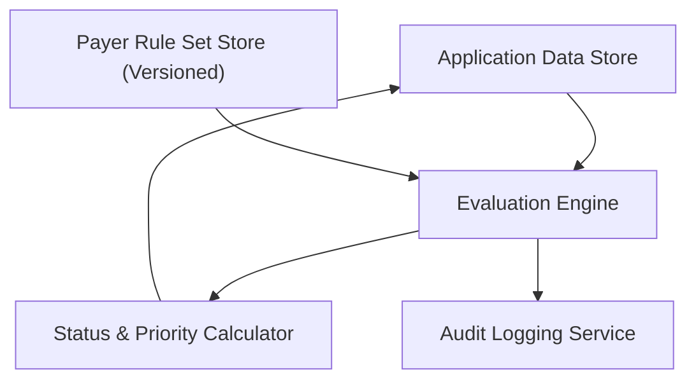

#### 1. High-Level Design
- Summary: Implement an automated evaluation engine that applies payer-specific, versioned rule sets to provider enrollment applications to determine readiness statuses and risk/priority at application, payer, and requirement levels, with correct historical rule versioning.
- Component Flow:

- Integration Points:
  - Rule set configuration and storage service with effective dates and versions  
  - Application data store holding enrollment data, documents, and expiration metadata  
  - Authentication/authorization services for secure access to evaluation and configuration data  
  - Audit/compliance logging subsystem to record evaluations against specific rule versions
- Key Assumptions:
  - Historical rule selection is based on effective-dating logic (e.g., submission or evaluation date stored with the application).
  - Status and priority outputs are persisted or exposed via APIs for consumption by queues, dashboards, and downstream reporting.
- NFR Highlights: Must comply with HIPAA for all stored and processed data; support versioned rule sets with historically correct evaluation; and deliver near real-time performance for individual evaluations and sub-second refresh for small lists where feasible.

#### 2. Validation Report
- Requirements Coverage: The design covers configurable versioned payer rules, multi-level readiness and requirement status evaluation, risk/priority scoring, historical rule version enforcement, and multi-payer status aggregation, while respecting HIPAA and performance constraints and explicitly excluding claims, billing, clinical data management, scanning/OCR, and automated payer portal submissions.

