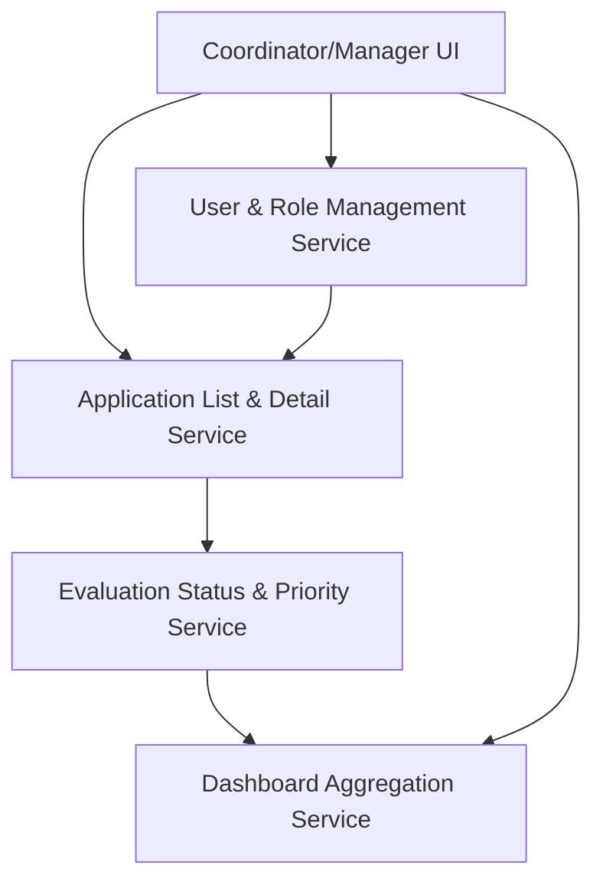

#### 1. High-Level Design
- Summary: Provide coordinators and enrollment managers with list views, prioritized work queues, and dashboards to visualize application readiness, status distribution, and workload with filtering, sorting, drill-down, and per-payer requirement details.
- Component Flow:

- Integration Points:
  - Evaluation engine providing readiness statuses and priority scores  
  - User and role management service (coordinators vs managers)  
  - Application and payer metadata services for filters and drill-downs  
  - Front-end/UI framework for list, detail views, and dashboards
- Key Assumptions:
  - Status and priority data are fetched from an existing evaluation service and not recalculated in the UI layer.
  - Role-based visibility rules are enforced via a centralized authorization layer used by all list and dashboard APIs.
- NFR Highlights: Views must support responsive list/dashboard retrieval for daily operations, reflect latest evaluation results consistently with rule versioning, and enforce role-based access aligned with HIPAA.

#### 2. Validation Report
- Requirements Coverage: The design supports application lists with filters, prioritized work queues, dashboards with drill-down, per-payer and per-requirement views, and overall status logic, while aligning with performance and role-based access NFRs and excluding time tracking, incentive dashboards, third-party BI, and external regulatory exports.

