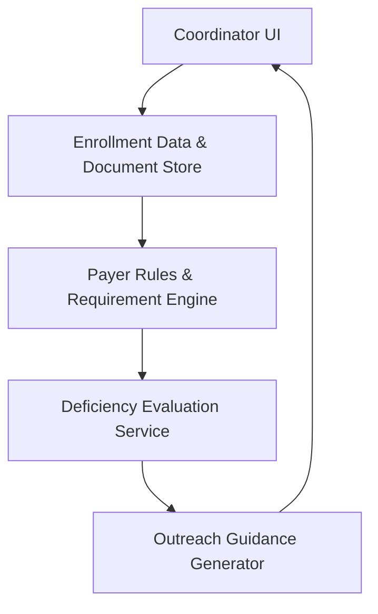

#### 1. High-Level Design
- Summary: Enable capture and management of provider enrollment application data and documents, and generate clear deficiency detection and outreach guidance so coordinators know exactly what to request to move applications to a ready state.
- Component Flow:

- Integration Points: 
  - Document storage or content management system for provider documents  
  - Application data repository for enrollment and re-credentialing records  
  - Payer rule set configuration library (including pre-built rule sets)  
  - UI components for data entry and deficiency/recommendation display
- Key Assumptions:
  - Payer rule sets are centrally managed and versioned by an admin-facing configuration tool.
  - Outreach guidance output is consumed via the coordinator UI and not auto-delivered via email/SMS.
- NFR Highlights: All application and document data handling must comply with HIPAA; storage and access must ensure confidentiality, integrity, controlled access, and deterministic, auditable recommendation generation.

#### 2. Validation Report
- Requirements Coverage: The design captures application data/documents, evaluates them against payer rules, identifies deficiencies at requirement level, and generates deterministic outreach guidance, aligning with the epic’s described scope and dependencies while explicitly excluding automated outreach delivery and external verification integrations.

