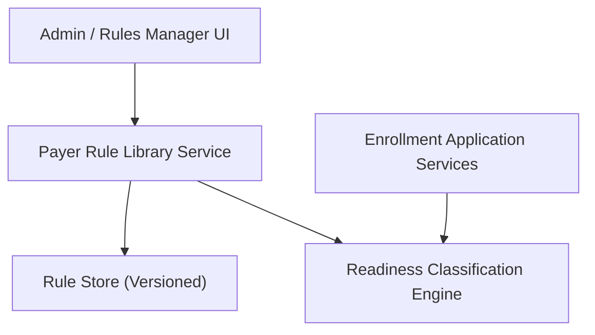

#### 1. High-Level Design

- Summary: Provide a configurable, versioned library of payer-specific requirement rule sets defining documents and data fields, with effective dates and multi-payer support, ensuring applications are evaluated against historically correct rules.

- Component Flow:

- Integration Points:
  - Provider enrollment application data store (to know target payers for an application)
  - Authentication and authorization services (for admin/rule maintainer access)
  - Audit/logging services (for rule changes and versioning)
  - Infrastructure/security services (HIPAA-compliant storage and access)

- Key Assumptions:
  - Rule versions include clear effective-from and effective-to dates and payer identifiers to support AC4’s historical evaluation requirement.
  - Admin UI operations (create/update/deprecate rule sets) are funneled through a single rule service to ensure consistent auditing and authorization.

- NFR Highlights:
  - NFRs require evaluation against submission-time rule versions, support for multiple concurrent versions per payer, acceptable performance for multi-payer evaluations, HIPAA-compliant management of payer data, and auditable configuration changes.

#### 2. Validation Report

- Requirements Coverage: The design supports a versioned payer rule library with effective dates, required document/field definitions, pre-built top-20 payer rule sets, multi-payer support, and auditable configuration changes, enabling the readiness engine to meet AC4 and related functional requirements.
