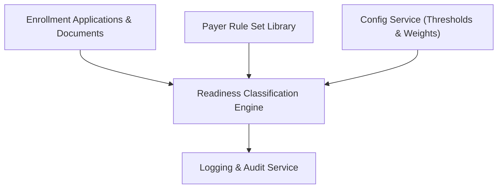

#### 1. High-Level Design

- Summary: Implement an automated engine to evaluate provider enrollment applications against payer-specific rules, compute per-payer and requirement-level readiness statuses, aggregate an overall “worst case” application status, and calculate risk/priority scores.

- Component Flow:

- Integration Points:
  - Payer rule set library (required documents, fields, effective dates)
  - Provider enrollment application data source (documents, data, expirations)
  - Configuration service (expiration thresholds, priority scoring weights)
  - Logging and audit services (evaluation outcomes and rule versions)

- Key Assumptions:
  - The engine exposes its results via APIs or events consumable by UI and reporting components, including per-payer and overall statuses plus priority scores.
  - Priority scoring rules are centrally configured and versioned in the configuration service to support deterministic and auditable behavior.

- NFR Highlights:
  - NFRs specify interactive latency, configurable thresholds, deterministic and auditable scoring, HIPAA-compliant operation, and resilience to partial data with clear handling of missing information.

#### 2. Validation Report

- Requirements Coverage: The design covers evaluation against payer rules, per-payer and requirement-level statuses, “worst case” aggregation, configurable Expiring Soon threshold, risk/priority scoring, and supports AC1–AC4 and AC10 scenarios leveraging rule versions and configuration services.

---