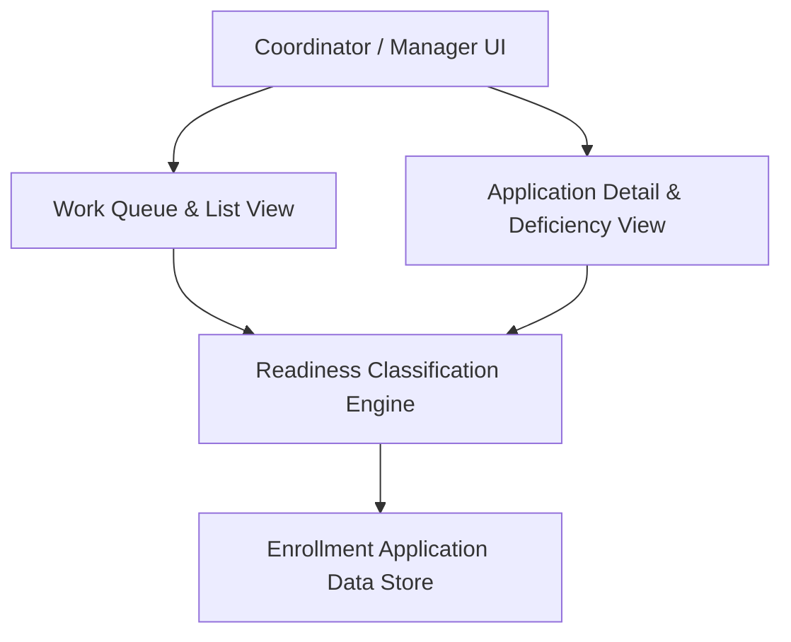

#### 1. High-Level Design

- Summary: Provide coordinators and managers with list and detail views of enrollment applications, including per-payer and requirement-level statuses, prioritized work queues, dashboards, and clear deficiency/defect communications for provider outreach.

- Component Flow:

- Integration Points:
  - Automated readiness classification engine (for statuses and priority scores)
  - Payer rule set library (for requirement definitions)
  - Provider enrollment application data store (applications, documents, coordinators)
  - User and role management (access control for coordinators/managers)
  - Notification / communication systems (for outreach templates if integrated)

- Key Assumptions:
  - Priority score and status values are provided by the readiness classification engine, not recalculated in the UI.
  - Dashboard metrics are derived from the same underlying application data store to ensure consistency across list, detail, and dashboard views.

- NFR Highlights:
  - NFRs specify responsive list/detail views, adequate dashboard query performance for near real-time monitoring, clear status differentiation, robust error handling, and full HIPAA Security and Privacy compliance.

#### 2. Validation Report

- Requirements Coverage: The design supports list and detail views, requirement-level status and deficiency presentation, prioritized work queues, and dashboards as described, relying on the readiness engine and rule library, and aligns with the stated NFRs and dependencies.

---