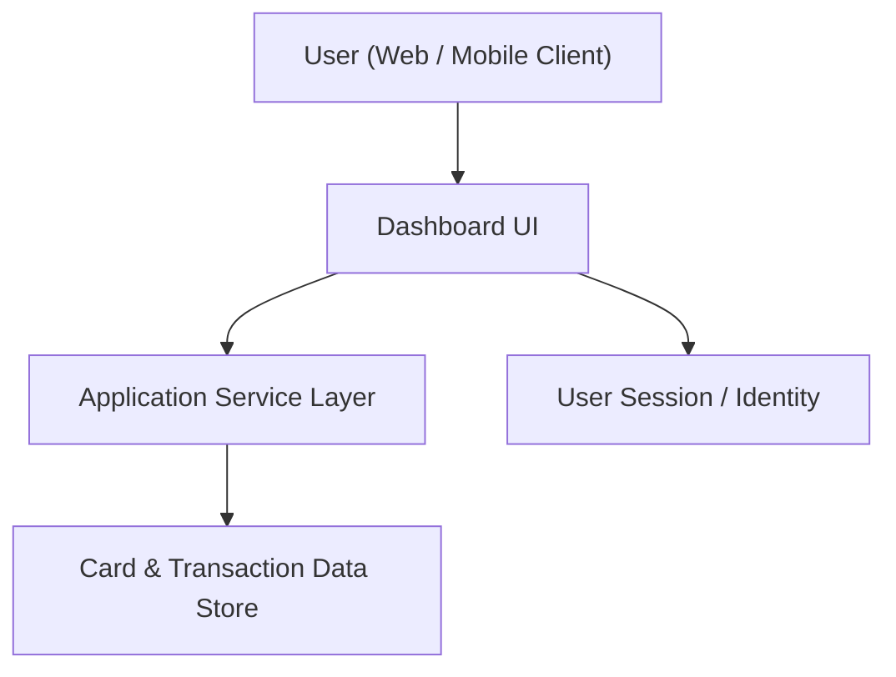

#### 1. High-Level Design
- Summary: Deliver a responsive dashboard that consolidates key credit card KPIs (monthly spend, total credit limit, available credit, outstanding amounts) across all user cards into a single, device-agnostic interface for monitoring overall credit usage.
- Component Flow:

- Integration Points:
  - Internal card and transaction data source/repository (for card details, limits, balances, transactions).
  - Internal application services for user and card data retrieval (no real bank integration).
- Key Assumptions:
  - Dashboard KPIs are calculated from periodically refreshed internal card/transaction data rather than real-time bank feeds.
  - All user cards accessible in the dashboard are already linked within the internal system.
- NFR Highlights: System must render KPIs with modern web app response times and maintain responsive, readable visualizations across mobile, tablet, and desktop.

#### 2. Validation Report
- Requirements Coverage: The design includes a responsive UI, consolidated multi-card KPIs (monthly spend, total credit limit, available credit, outstanding amounts), and integration with internal card/transaction data, aligned with the epic’s stated scope and NFRs.

---
