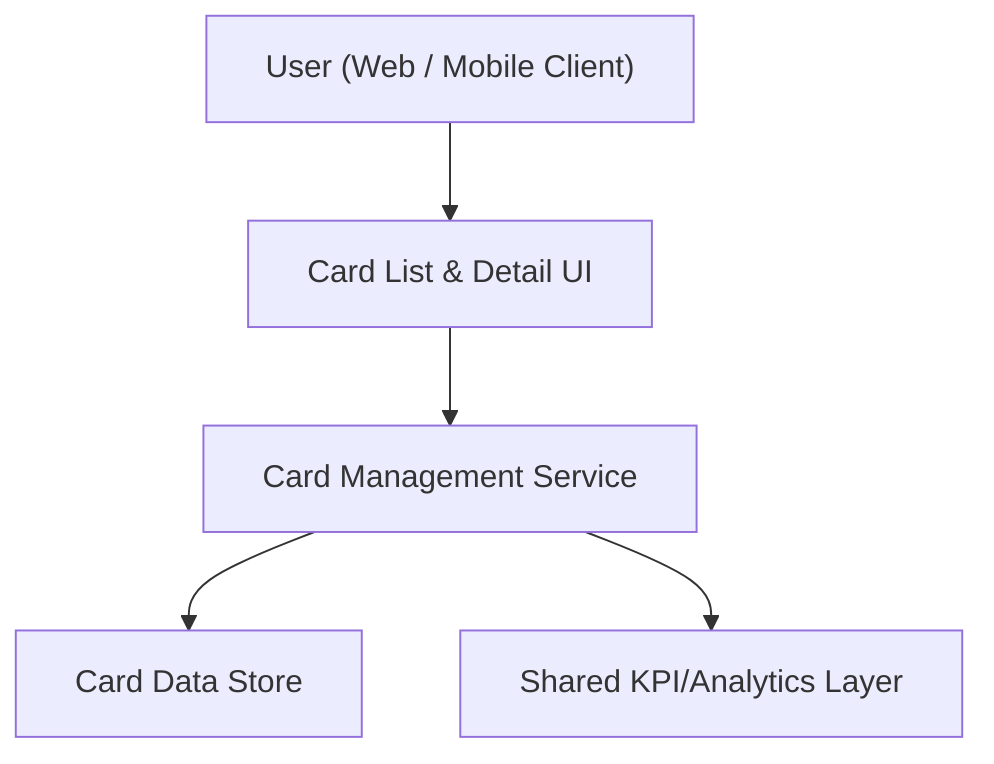

#### 1. High-Level Design
- Summary: Provide a unified interface for listing and managing multiple credit cards per user, showing card-specific KPIs (credit limit, available credit, outstanding balance) and aggregated multi-card metrics to simplify multi-card monitoring.
- Component Flow:

- Integration Points:
  - Internal services or data stores providing card-level information (limits, balances, identifiers).
  - Shared data layer used by dashboard KPIs to ensure consistent card data across features.
- Key Assumptions:
  - Card identifiers and basic metadata (e.g., card nickname, last 4 digits) are already available in the internal data store.
  - Aggregated KPIs and per-card KPIs reuse the same calculation logic as the dashboard to avoid duplication.
- NFR Highlights: System must handle multiple cards per user without noticeable UI performance degradation and maintain clear, readable data presentation when many cards are present.

#### 2. Validation Report
- Requirements Coverage: The design supports listing all user cards, showing card-specific KPIs, aggregating multi-card metrics, and reusing the shared data foundation, matching the epic’s scope and performance/readability NFRs.

---
