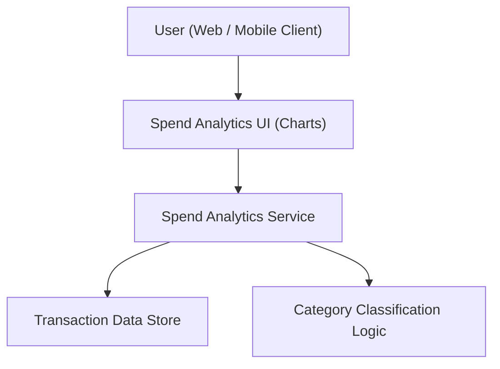

#### 1. High-Level Design
- Summary: Deliver interactive spend analytics that provide monthly spend trends, category-wise spending views, and card-wise spend analysis using transaction-level data, helping users understand and act on their spending patterns.
- Component Flow:

- Integration Points:
  - Internal transaction data source for historical card transactions.
  - Categorization logic/service to classify transactions into defined categories (Food & Dining, Fuel, Shopping, etc.).
  - Shared card and transaction data foundation reused by dashboard and multi-card management.
- Key Assumptions:
  - Transaction categorization rules or mappings are pre-defined and maintained within the internal system.
  - Analytics operate on typical monthly transaction volumes, not real-time streaming or high-frequency feeds.
- NFR Highlights: Analytics visualizations must remain responsive and interactive, with charts rendering in reasonable time and maintaining usability across responsive layouts.

#### 2. Validation Report
- Requirements Coverage: The design covers monthly trend charts, category-wise and card-wise analytics, uses transaction-level data with categorization logic, and aligns with responsiveness and visualization NFRs described in the epic.
