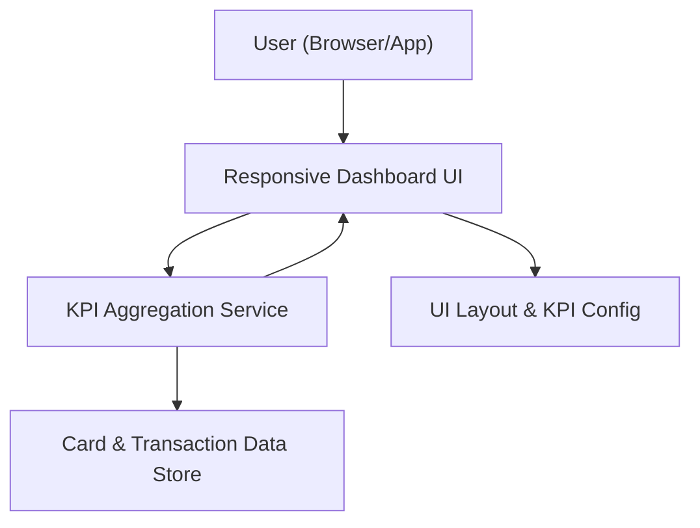

#### 1. High-Level Design
- Summary: Build a modern, responsive dashboard that consolidates core credit card KPIs (monthly spend, total credit limit, available credit, outstanding amount) across multiple cards into a single unified view with summary tiles and basic visual indicators.
- Component Flow:

- Integration Points:
  - Internal card and transaction data sources or mock data stores for KPI computation.
  - Front-end framework capable of responsive layouts (e.g., responsive grid/layout system).
- Key Assumptions:
  - KPI data is exposed via internal APIs or services that provide card and transaction data with sufficient granularity for KPI calculations.
  - Dashboard authentication and user session handling are provided by an existing platform layer and not implemented within this epic.
- NFR Highlights: Dashboard must be responsive across mobile/tablet/desktop, update KPI calculations within 2 seconds of data changes, and display at least 10 cards without layout degradation.

#### 2. Validation Report
- Requirements Coverage: The design includes a responsive UI, KPI aggregation service, and integration with internal data stores, covering unified multi-card KPIs, summary tiles, and performance/responsiveness constraints described in the epic.

---
