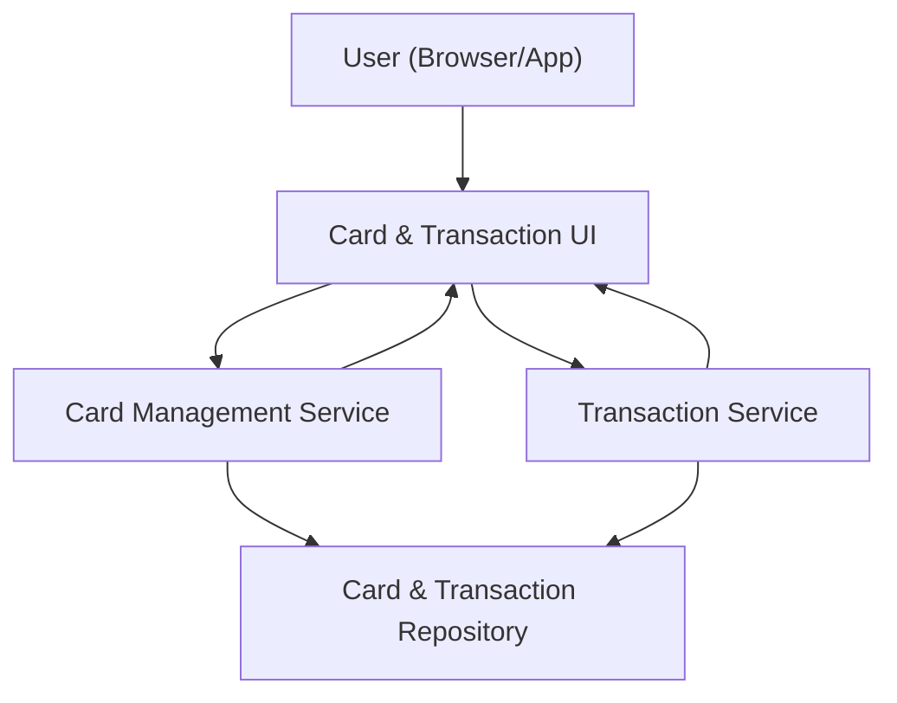

#### 1. High-Level Design
- Summary: Provide capabilities to manage and present multiple credit cards and their associated transactions, including card-level limits, available credit, outstanding balances, and recent transaction details with basic attributes, all within the dashboard.
- Component Flow:

- Integration Points:
  - Internal transaction repositories or mock data feeds for card and transaction information.
  - Shared components for data formatting and currency display across the dashboard.
- Key Assumptions:
  - Card and transaction retrieval APIs support filtering by authenticated user and by card, returning up to at least 12 months of data per card for summary views.
  - Access control and identity verification are enforced by the platform layer, with this epic consuming already-filtered, user-specific data.
- NFR Highlights: Must handle at least 12 months of transaction data per card without noticeable degradation in summary views; card and transaction retrieval should complete within 3 seconds; data visibility is restricted to the authenticated user context.

#### 2. Validation Report
- Requirements Coverage: The design separates card and transaction services, connects them to a shared repository, and surfaces data via a dedicated UI, addressing multi-card representation, card-level KPIs, transaction listing, aggregated per-card metrics, and the specified performance and security-related NFRs.

---
