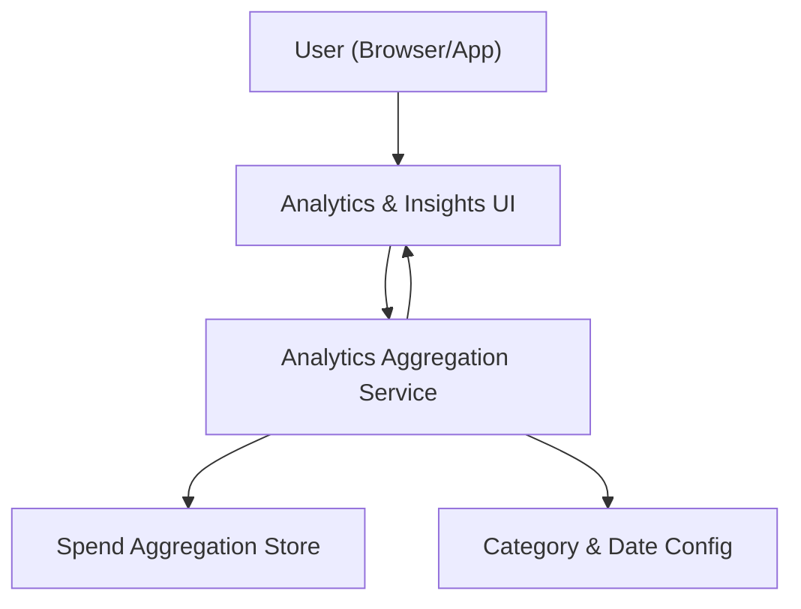

#### 1. High-Level Design
- Summary: Deliver interactive analytics and visualizations to show spending trends over time, card-wise and category-wise spend analysis, with filters by card and timeframe, and basic insights derived from these views to support budgeting and planning.
- Component Flow:

- Integration Points:
  - Transaction data aggregation and categorization services providing summarized and categorized spend data.
  - Charting/visualization libraries for rendering interactive charts.
  - Shared date and category configuration used across cards and transactions.
- Key Assumptions:
  - Aggregated spend data (per card, per category, per period) is precomputed or efficiently queryable so that filters and interactions can respond within the 2-second limit.
  - Category taxonomy (e.g., Food & Dining, Fuel, Shopping, etc.) is centrally managed and consistent across all card and transaction data sources.
- NFR Highlights: Interactive charts must respond to filters/interactions within 2 seconds, support at least 24 months of summarized spend, and render correctly across supported devices and screen sizes.

#### 2. Validation Report
- Requirements Coverage: The design introduces an analytics aggregation service and store, uses shared configuration for categories and dates, and a dedicated analytics UI with charting, covering trend views, card-wise and category-wise analytics, filter capabilities, and the specified performance and cross-device rendering constraints.
