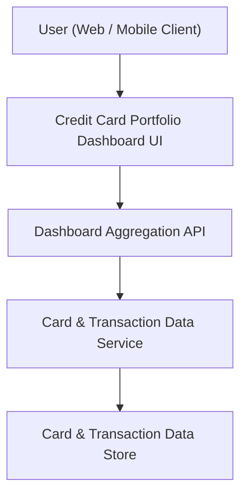

#### 1. High-Level Design
- Summary: Provide a consolidated, responsive dashboard that surfaces high-level credit card KPIs (monthly spend, total credit limit, available credit, outstanding amount) across all cards so users can quickly understand their overall credit position.
- Component Flow:

- Integration Points:
  - Internal card and transaction data store or API within system boundary.
  - Internal/mock data services for card, limit, and transaction information feeding dashboard KPIs.
- Key Assumptions:
  - Dashboard consumes pre-aggregated metrics or performs lightweight aggregation over card and transaction data per user session.
  - Authentication and user identity resolution are managed by an existing platform layer and not implemented within this epic.
- NFR Highlights:
  - Responsive layouts for desktop and mobile; dashboard KPIs must load with consumer-acceptable latency and handle multiple cards per user without performance degradation.

#### 2. Validation Report
- Requirements Coverage: The design supports a single multi-card dashboard, surfaces all required KPIs (monthly spend, total credit limit, available credit, outstanding amount), uses responsive UI, and consumes internal card/transaction services in line with the epic scope and dependencies.
