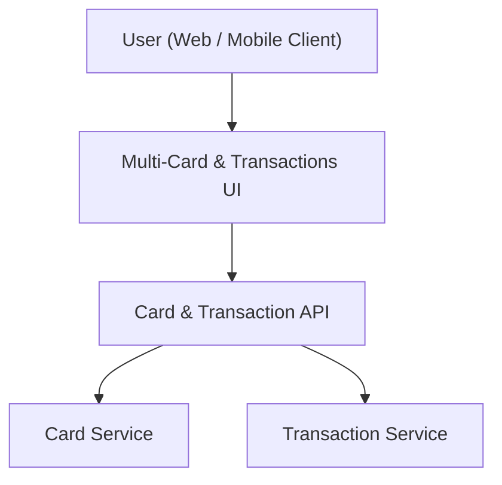

#### 1. High-Level Design
- Summary: Enable users to list, select, and view details for individual credit cards, including per-card limits, outstanding amounts, available credit, and transaction histories that underpin dashboard KPIs, with smooth navigation between cards.
- Component Flow:

- Integration Points:
  - Internal card data repository/service providing card list, limits, and per-card metadata.
  - Internal transaction data repository/service providing per-card transaction histories aligned with dashboard metrics.
  - Shared data model integrating card and transaction data for both card views and dashboard.
- Key Assumptions:
  - Card and transaction services expose queries keyed by user identity and card identifier to support list, select, and detail views.
  - Transaction listing supports basic filtering/sorting (date, amount, category) as part of standard list capabilities, without advanced analytics logic in this epic.
- NFR Highlights:
  - System must handle multiple cards per user without noticeable performance issues; transaction list performance should remain acceptable and data presentation consistent and accurate across cards and transactions.

#### 2. Validation Report
- Requirements Coverage: The design covers listing all cards, switching between cards, per-card overview metrics, and per-card transaction history using shared card/transaction services, aligning with the epic’s scope, NFRs, and dependency on a common data model.
