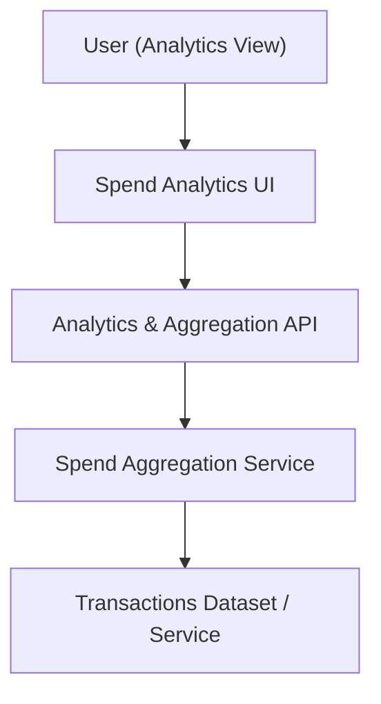

#### 1. High-Level Design
- Summary: Provide interactive spend analytics visualizations (monthly trends, card-wise and category-wise spend) across predefined categories, allowing users to explore how spending is distributed and changes over time, with basic filters for card and time period.
- Component Flow:

- Integration Points:
  - Transactions dataset/service used by dashboard and card views as the single source of truth.
  - Shared data services for spend aggregation and trend calculations across cards and categories.
  - Consistent transaction categorization into predefined spend categories (Food & Dining, Fuel, Shopping, Travel, Entertainment, Utilities, Healthcare, Education, Miscellaneous).
- Key Assumptions:
  - Transaction records include or can be enriched with standardized category fields aligned to the defined category list.
  - Analytics endpoints provide pre-aggregated or efficiently aggregatable data for selected time periods and cards to support interactive UI latency.
- NFR Highlights:
  - Analytics visualizations must render within acceptable latency for interactive dashboards and handle typical consumer transaction volumes while remaining responsive across supported devices.

#### 2. Validation Report
- Requirements Coverage: The design supports monthly trend charts, card-wise and category-wise analytics, interaction with dashboard KPIs, and basic card/time filters using a shared transaction dataset and aggregation service, matching the epic’s stated scope, NFRs, and dependencies.
