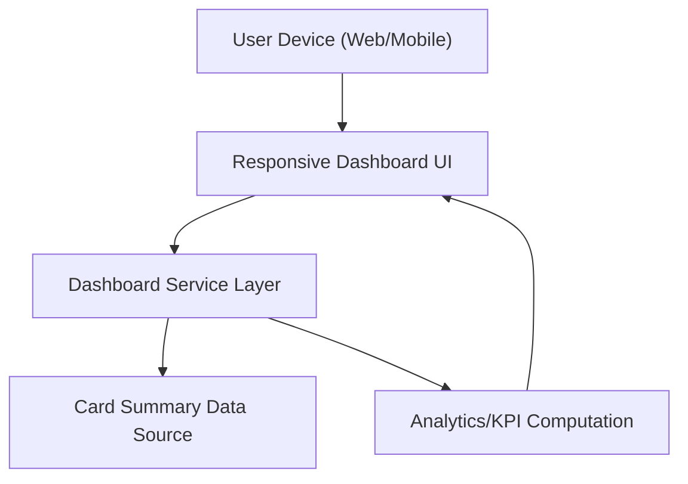

#### 1. High-Level Design
- Summary: Deliver a unified, responsive dashboard that aggregates key credit card KPIs (monthly spend, total credit limit, available credit, outstanding amount) across all user cards, giving users a single at-a-glance view of their overall credit exposure and utilization.

- Component Flow:

- Integration Points:
  - Internal card summary data sources or mocked services providing per-card and aggregated KPIs.
  - Front-end framework (e.g., SPA framework and chart widgets) used for responsive layout and KPI rendering.

- Key Assumptions:
  - Dashboard service consumes already-cleansed, periodically refreshed summary data from internal/mock APIs rather than live bank systems.
  - Authentication and user identity are handled by a shared platform layer, and the dashboard receives a resolved user context.

- NFR Highlights:
  - Fast rendering of KPIs for typical consumer portfolios, responsive across common device sizes, and accuracy/consistency of KPI data across all dashboard sections.

#### 2. Validation Report
- Requirements Coverage: The design covers consolidated KPI display across all cards, responsive UI, and usage of internal/mock data sources as described in the epic, staying within the stated scope and exclusions.
