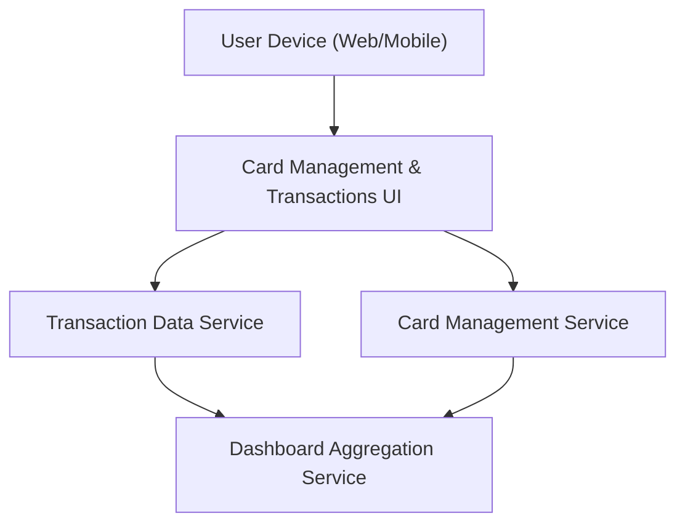

#### 1. High-Level Design
- Summary: Provide a unified interface where users can manage multiple credit cards, see per-card summaries (limit, available credit, outstanding), switch between cards, and view basic transaction listings whose aggregates feed the main dashboard KPIs.

- Component Flow:

- Integration Points:
  - Internal card master and transaction data services or mocked back-end APIs providing card profiles, limits, available credit, outstanding balances, and transaction lists.
  - Categorization logic or data fields for associating transactions with spending categories, which also support analytics and dashboard KPIs.

- Key Assumptions:
  - Recent transactions are retrieved via paginated APIs optimized for latest activity; deep history may be handled via separate views or APIs if needed later.
  - Card selection state (active card) is maintained on the client and passed in each request to determine which card’s data to fetch.

- NFR Highlights:
  - Must handle multiple cards per user without noticeable performance degradation, ensure performant loading of recent transactions, and maintain data consistency between card-level views and overall dashboard KPIs.

#### 2. Validation Report
- Requirements Coverage: The design supports multiple cards per user, card-level summaries, card switching, basic transaction lists, and aggregation into dashboard KPIs, aligning with the epic’s described scope and NFRs.
