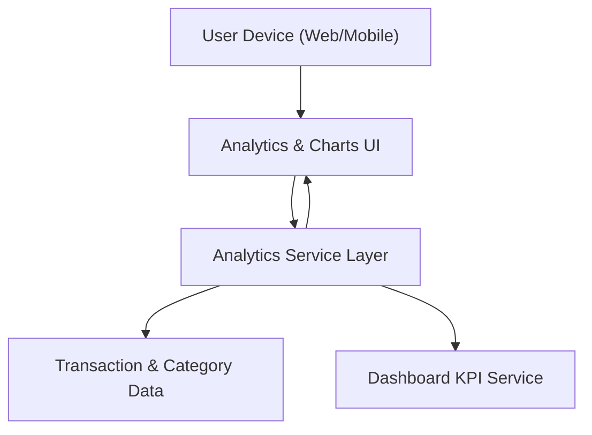

#### 1. High-Level Design
- Summary: Implement analytical visualizations for monthly spend trends, card-wise spend analysis, and interactive category-wise insights across predefined categories, turning transaction data into actionable insights aligned with dashboard KPIs.

- Component Flow:

- Integration Points:
  - Transaction data and categorization source (same underlying data services used by dashboard and card management).
  - Front-end charting/visualization libraries for rendering trends, card-wise comparisons, and category-wise breakdowns.

- Key Assumptions:
  - Transactions are pre-tagged with one of the predefined categories (Food & Dining, Fuel, Shopping, Travel, Entertainment, Utilities, Healthcare, Education, Miscellaneous) before analytics computation.
  - Analytics service computes aggregates in near-real-time or on-demand using the same datasets and rules as the dashboard KPIs to avoid mismatches.

- NFR Highlights:
  - Visualizations must load and update smoothly to maintain interactivity, remain readable on responsive layouts, and ensure category calculations are accurate and consistent with underlying transactions and KPIs.

#### 2. Validation Report
- Requirements Coverage: The design addresses monthly and card-wise spend analytics, predefined category-wise charts, interactive filtering by card/time, and alignment with dashboard KPIs, in line with the epic’s scope, dependencies, and NFRs.
