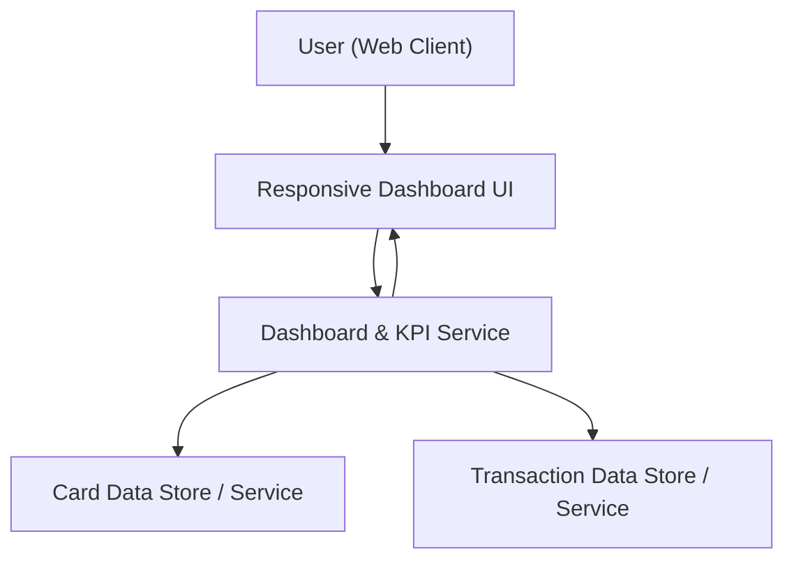

#### 1. High-Level Design
- Summary: Deliver a modern, responsive dashboard that consolidates all credit cards, showing core financial KPIs (monthly spend, total limit, available credit, outstanding amount) and basic card-level info so users can monitor their credit profile in one place.

- Component Flow:

- Integration Points:
  - Internal card data source or mock card data store for card listing and summary tiles.
  - Internal transaction data source or mock transaction data store to compute monthly spend and outstanding amounts.
  - Front-end visualization library for responsive KPI tiles and dashboard layout.

- Key Assumptions:
  - KPI calculations (monthly spend, limits, available credit, outstanding) are derived from normalized card and transaction data in internal stores.
  - Data refresh is near-real-time or periodic (e.g., batch updates) within the application, with no external bank connectivity.

- NFR Highlights:
  - Dashboard KPIs must load with minimal latency for typical consumer card portfolios, with responsive layouts across mobile, tablet, and desktop, and basic in-app data security; no handling of real banking credentials.

#### 2. Validation Report
- Requirements Coverage: The design supports a unified responsive dashboard, consolidated card view, all specified KPIs, card listing and summary tiles, and basic card-level information using internal/mock data and visualization libraries, aligning with in-scope dashboard objectives and excluding real bank integration and payments.
