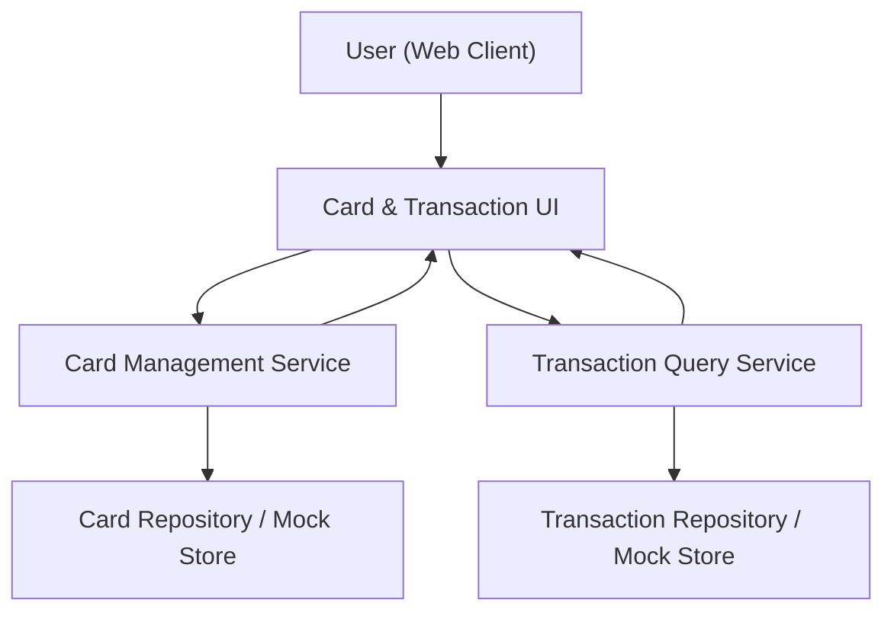

#### 1. High-Level Design
- Summary: Provide a single interface for users to manage and view one or multiple credit cards, with per-card summaries and read-only transaction visibility, including basic navigation and filtering/sorting across cards.

- Component Flow:

- Integration Points:
  - Internal card repository or mock card data store for multi-card list, limits, and outstanding amounts.
  - Internal transaction repository or mock transaction data store for per-card transaction listing.
  - UI components for card selection, navigation between cards, and transaction list rendering with basic filtering/sorting.

- Key Assumptions:
  - Transactions are exposed in a read-only format with basic metadata (date, amount, category/description) adequate for visibility and simple analysis.
  - Card and transaction repositories are logically separated but keyed so that the transaction service can efficiently query by card identifier.

- NFR Highlights:
  - The system must support typical consumer volumes of cards and transactions with acceptable UI response times; data is read-only, with no real bank backend connectivity, and is presented without payment execution capabilities.

#### 2. Validation Report
- Requirements Coverage: The design covers multi-card support, unified card list, per-card summaries, transaction listing per card, navigation between cards and transactions, and basic filtering/sorting, using internal repositories and UI components, while respecting performance and read-only/non-integration constraints.
